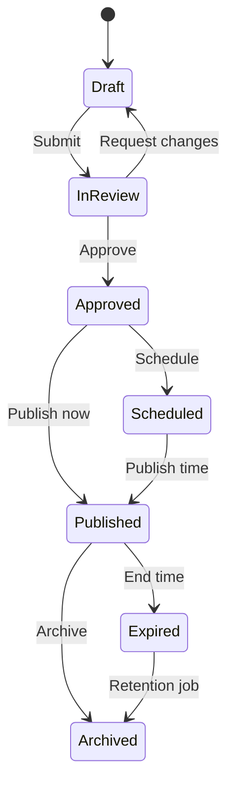
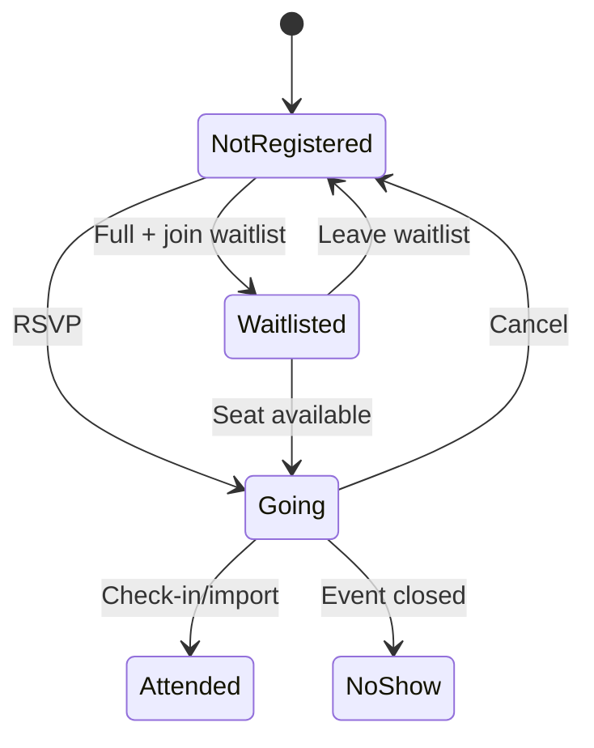
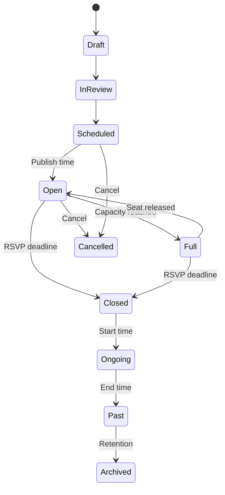
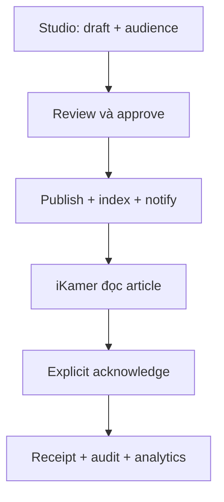
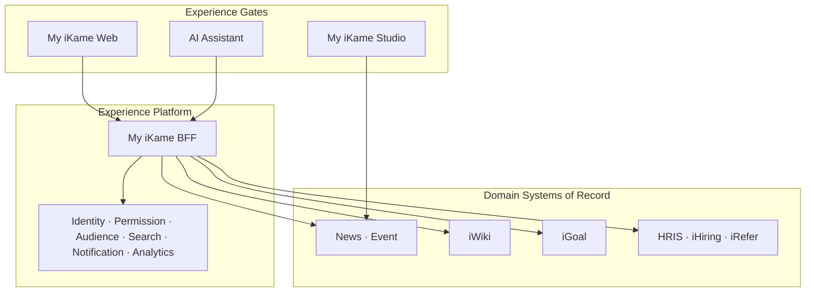
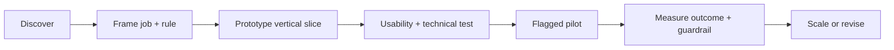

# My iKame — Product Experience & Platform Specification

**Version:** 0.2  
**Status:** Proposed / build-ready for prototype  
**Product owner:** BM Team  
**Primary audiences:** iKamer và Manager  
**Companion backstage product:** My iKame Studio dành cho Operations  
**Target experience:** Web responsive, desktop-first  
**Last updated:** 11/08/2026

---

## 0. Cách sử dụng tài liệu

Tài liệu này có hai lớp, cần đọc tách biệt:

1. **Target Experience Spec** mô tả My iKame khi đã trở thành Employee Experience Gate hoàn chỉnh.
2. **Release Slices** quy định phần nào được prototype và phát hành trước. Target experience không đồng nghĩa với scope của một release.

Quy ước:

- **MUST:** bắt buộc để đạt acceptance.
- **SHOULD:** ưu tiên làm nếu không làm tăng rủi ro phát hành.
- **MAY:** lựa chọn mở rộng.
- Mọi target số chưa có baseline được ghi là `TBD`; team không tự đặt số đẹp để báo cáo.
- Tên chuẩn trong toàn bộ tài liệu: **My iKame**, **iKamer**, **Manager**, **iGoal**, **iWiki**, **iHiring**, **iRefer**, **HRIS**.

---

# PHẦN A — QUYẾT ĐỊNH SẢN PHẨM

## 1. Executive decisions

| # | Quyết định | Hệ quả thiết kế và kỹ thuật |
|---|---|---|
| D1 | My iKame là **Employee Experience Gate**, không phải nơi gom toàn bộ màn hình của mọi công cụ | My iKame chỉ giữ tác vụ phổ biến, ngắn, đúng ngữ cảnh; nghiệp vụ cấu hình hoặc vận hành sâu dùng deep link sang công cụ domain |
| D2 | My iKame chỉ phục vụ **iKamer và Manager** | Operations không xuất hiện trong persona, menu hoặc permission của My iKame; họ dùng My iKame Studio hoặc công cụ domain |
| D3 | Home phải ưu tiên **việc cần làm** hơn nội dung mới | Mandatory, overdue, due soon và sự kiện hôm nay đứng trước news/recommendation |
| D4 | Manager experience là **attention & action canvas**, không phải BI dashboard | Mỗi insight MUST nêu đối tượng, lý do, mức độ và hành động tiếp theo |
| D5 | Personalization bắt đầu bằng rule minh bạch, không dùng ML sớm | Xếp hạng dựa trên role, audience, deadline, severity và freshness; có thể giải thích được |
| D6 | H2 production scope là **Newsfeed + Event** | Knowledge, Goals và AI được mô tả để giữ kiến trúc nhưng không chen vào critical path của H2 |
| D7 | Platform ban đầu là **modular core + BFF + adapters** | Không tách microservice hoặc microfrontend chỉ để “đúng kiến trúc”; tách khi có ownership và scale độc lập thật |
| D8 | Permission là thuộc tính của mọi trải nghiệm | Home, search, notification, analytics và AI đều MUST kiểm tra quyền; không được lộ cả title của nội dung không có quyền |
| D9 | AI là lớp tăng tốc sau search và data foundation | Không build chatbot chung khi chưa có permission-aware retrieval, source citation, audit và API hành động |

### 1.1 Product statement

> My iKame giúp mỗi iKamer biết **hôm nay có gì cần đọc, cần tham gia, cần làm**, và giúp mỗi Manager biết **đội ngũ đang có ngoại lệ nào cần mình xử lý**, trong một trải nghiệm cá nhân hóa, an toàn và nhất quán.

### 1.2 One-line test

Một capability chỉ nên xuất hiện native trong My iKame nếu phần lớn người dùng mục tiêu có thể hoàn thành nó trong **một ngữ cảnh, một phiên ngắn và không cần hiểu cấu hình nghiệp vụ phía sau**.

Nếu không qua được phép thử này, My iKame hiển thị summary + CTA + deep link có context.

## 2. Bài toán cần giải quyết

### 2.1 Hiện trạng

- iKamer phải nhớ tên và cách dùng nhiều công cụ để đọc thông tin hoặc hoàn thành công việc.
- Cùng một user context, permission, notification và dữ liệu tổ chức đang có nguy cơ được triển khai lặp lại.
- Mỗi công cụ tối ưu theo domain của nó; chưa có lớp tối ưu hành trình xuyên domain của iKamer và Manager.
- Manager dễ bị đưa cho nhiều số liệu nhưng thiếu danh sách ngoại lệ có thể hành động.
- Việc tích hợp theo kiểu nhúng toàn bộ UI sẽ làm My iKame nặng, khó hiểu và khó duy trì.

### 2.2 Outcome mong muốn

- iKamer mở một điểm vào và nhận đúng nội dung/tác vụ theo vai trò, đơn vị, địa điểm và thời điểm.
- Manager xử lý nhanh các item cần chú ý mà không phải duyệt nhiều dashboard.
- Operations tiếp tục có công cụ chuyên sâu và workflow kiểm soát nội dung/nghiệp vụ.
- Domain systems vẫn là source of truth; My iKame không tạo thêm bản sao dữ liệu thiếu ownership.
- Mỗi integration mới tái sử dụng identity, org, permission, card, search, notification và analytics contracts.

## 3. Benchmark đã chuyển hóa thành quyết định

| Benchmark | Pattern đáng học | Áp dụng vào My iKame | Không sao chép lúc này |
|---|---|---|---|
| [Microsoft Viva Connections](https://learn.microsoft.com/en-us/viva/connections/viva-connections-overview) | Dashboard card, resource, news; audience/device preview; card có thể hoàn thành quick task hoặc deep link | Card contract, audience preview, responsive composition | Hệ sinh thái extension phức tạp hoặc marketplace |
| [ServiceNow Employee Center](https://www.servicenow.com/products/employee-center.html) | Search nổi bật, active items, recommended content, taxonomy xuyên knowledge/service | Home thiên về active items; taxonomy theo nhu cầu thay vì tên tool | Service catalog/low-code platform đầy đủ |
| [ServiceNow Manager Hub](https://www.servicenow.com/docs/r/employee-service-management/hr-service-delivery/manager-hub-overview.html) | Urgent action, team event, insight kèm gợi ý, manager library | Manager attention queue và resources theo ngữ cảnh | Toàn bộ HR workflow trong My iKame |
| [Workday Manager Insights Hub](https://doc.workday.com/admin-guide/en-us/human-capital-management/hcm-hubs/manager-insights-hub/dma1653935379909.html) | Required trước optional, overdue trước due soon; chỉ hiển thị card của feature đang bật và user có quyền | Priority bands; capability-driven rendering; direct-report scope mặc định | ML recommendation và các quy trình C&B phức tạp |
| [Staffbase highlighting & acknowledgement](https://support.staffbase.com/hc/en-us/articles/33568284011538-Overview-of-Highlighting-and-Acknowledgements-for-News-Posts) | Important label, explicit acknowledgement, audit trail, nhắc lại người chưa xác nhận | Mandatory news khác read state; resend chỉ tới non-acknowledger | Mặc định biến mọi bài thành mandatory |
| [Staffbase campaigns](https://support.staffbase.com/hc/en-us/articles/360021092579-Overview-of-Campaigns) | Goal, editorial timeline, draft/scheduled/published, campaign analytics | Content workflow, campaign metadata, reach-to-action funnel | Công cụ campaign marketing đầy đủ |
| [Workvivo Events](https://support.workvivo.com/hc/en-gb/articles/4918164392861-Creating-and-Managing-Events) | Global/team audience, booking CTA, calendar, reminder sát ngày, future/past | Event lifecycle, RSVP, calendar, day-before/day-of reminder | Social community suite |
| [Workvivo Notifications](https://support.workvivo.com/hc/en-gb/articles/4918159137181-Adjusting-your-Notification-Settings) | Group notification, channel preference, read/unread | Digest/grouping và preference; chống notification fatigue | Gửi từng notification cho mọi activity |
| [SAP Build Work Zone](https://www.sap.com/products/technology-platform/workzone.html) | Role-based entry point, composable workpage/widget, app/task/insight integration | Role-based shell và module slot | Low-code workpage builder ở giai đoạn đầu |
| [Glean Enterprise Search](https://www.glean.com/enterprise-search) | Multi-source, permission-aware search, context personalization | Search index có ACL; result theo type/source | Enterprise AI/search platform tự build toàn bộ |
| [WCAG 2.2](https://www.w3.org/TR/WCAG22/) | Tiêu chí testable cho keyboard, focus, contrast, target, authentication | WCAG 2.2 AA là release gate | Chỉ dùng Lighthouse để kết luận accessibility |

## 4. Audiences và Jobs to Be Done

### 4.1 iKamer

**Bối cảnh:** mở app trong các khoảng thời gian ngắn; chủ yếu muốn biết điều gì liên quan trực tiếp tới mình.

| Job | Câu hỏi người dùng | Kết quả mong muốn |
|---|---|---|
| Bắt đầu ngày làm việc | “Hôm nay tôi cần chú ý gì?” | Thấy tối đa 3 item ưu tiên, có CTA rõ |
| Nắm thông tin chính thức | “Thông báo này có áp dụng cho tôi không?” | Biết nguồn, đối tượng, thời hạn và yêu cầu xác nhận |
| Tham gia hoạt động | “Sự kiện nào phù hợp, còn chỗ không?” | RSVP nhanh, thêm calendar, nhận reminder hợp lý |
| Tìm tri thức | “Quy định/hướng dẫn nằm ở đâu?” | Tìm đúng nguồn có quyền và đọc/deep link trong một hành trình |
| Theo dõi mục tiêu | “Mục tiêu nào sắp trễ, tôi cần cập nhật gì?” | Xem trạng thái và check-in đơn giản; nghiệp vụ sâu sang iGoal |
| Quản lý sự chú ý | “Tôi đã đọc/xử lý gì rồi?” | Read/acknowledged/done states nhất quán |

### 4.2 Manager

Manager có toàn bộ jobs của iKamer và thêm:

| Job | Câu hỏi người dùng | Kết quả mong muốn |
|---|---|---|
| Triage đội ngũ | “Ai hoặc việc gì cần tôi chú ý trước?” | Queue xếp theo severity, deadline và impact |
| Hiểu ngoại lệ | “Vì sao item này bị flag?” | Thấy evidence ngắn, timestamp và source |
| Hành động | “Tôi làm gì tiếp theo?” | Native quick action hoặc deep link đúng context |
| Theo dõi sau hành động | “Việc đã giải quyết chưa?” | Item chuyển trạng thái, không còn hiện sai trong queue |
| Chuẩn bị quản lý | “Tôi cần thông tin/hướng dẫn gì cho tình huống này?” | Manager resource được gợi ý đúng ngữ cảnh |

### 4.3 Operations là backstage actor, không phải audience của My iKame

Operations gồm COM, TA, L&OD, C&B và các team sở hữu nghiệp vụ. Họ:

- biên tập, review, publish, schedule, archive;
- cấu hình audience, campaign và acknowledgement;
- vận hành event, capacity, attendance, recap;
- theo dõi analytics và audit;
- quản trị dữ liệu/nghiệp vụ sâu trong iGoal, iWiki, iHiring, HRIS hoặc My iKame Studio.

**Rule:** không thêm menu admin vào My iKame chỉ vì cùng backend. Boundary trải nghiệm phải rõ ngay cả khi hai app dùng chung component hoặc repository.

## 5. Experience principles

1. **Action before information:** item cần xử lý đứng trước nội dung để tham khảo.
2. **Relevant before recent:** liên quan tới user quan trọng hơn mới nhất toàn công ty.
3. **Progressive disclosure:** card cho summary; detail cho ngữ cảnh; domain tool cho nghiệp vụ sâu.
4. **Explainable personalization:** user có thể hiểu “Vì sao tôi thấy nội dung này?”.
5. **Permission-aware by construction:** không render rồi mới che; lọc quyền trước khi tạo experience.
6. **One action, one owner:** mọi CTA ghi rõ hệ thống xử lý và trạng thái thành công/thất bại.
7. **Calm, not noisy:** giới hạn card, badge, màu cảnh báo và notification.
8. **Accessible default:** keyboard, focus, contrast, responsive và reduced motion là điều kiện hoàn thành.
9. **Measured usefulness:** đo hoàn thành hành động, không tối ưu chỉ cho page view.
10. **Domain truth:** My iKame không âm thầm trở thành source of truth mới.

## 6. Non-goals

- Không thay thế iGoal, iWiki, iHiring, iRefer hoặc HRIS.
- Không đưa Operations console vào navigation của iKamer/Manager.
- Không xây social network nội bộ đầy đủ ở H2.
- Không build page builder, plugin marketplace, microfrontend runtime hoặc workflow engine tổng quát trong prototype.
- Không dùng AI để quyết định quyền, tự publish nội dung hoặc ghi dữ liệu nhạy cảm mà không có xác nhận.
- Không làm dashboard với nhiều chart chỉ vì dữ liệu có sẵn.
- Không cho Manager thấy dữ liệu ngoài management scope được cấp.

---

# PHẦN B — RELEASE STRATEGY

## 7. Release slices

### 7.1 Scope map

| Slice | Mục tiêu | Native capabilities | Out of scope | Exit gate |
|---|---|---|---|---|
| **R0 — Vibe-code prototype** | Kiểm chứng IA, card hierarchy và 2 role experiences | App shell; iKamer Home; Manager Overview; News; Event; notification/search shell; mock data | Production auth/API, Studio đầy đủ, Knowledge/Goal write, AI | ≥80% critical tasks hoàn thành trong usability test; không có lỗi navigation blocker |
| **R1 — H2 Production Core** | Phát hành Newsfeed + Event an toàn | Keycloak SSO; audience; news read/acknowledge; event RSVP/calendar; in-app notification; analytics/audit | Knowledge, Goals, AI; comments nếu chưa có moderation | Security/data review; WCAG AA critical; production telemetry; rollback runbook |
| **R2 — Knowledge read pilot** | Chứng minh integration pattern với iWiki | Permission-aware search; knowledge result; reader hoặc deep link | Authoring iWiki trong My iKame | Không lộ title; search quality baseline; owner sign-off |
| **R3 — Goal action pilot** | Chứng minh write pattern với iGoal | Goal summary; simple check-in; Manager attention | Goal configuration, calibration, bulk ops | Idempotent write; audit; reconciliation; domain owner sign-off |
| **R4 — AI read-only** | Giảm thời gian tìm/hiểu | Ask; grounded answer; citation; permission filter; feedback | Autonomous action, cross-domain write | Retrieval eval; permission tests; hallucination/error UX; kill switch |
| **R5 — Assisted action** | Cho AI chuẩn bị hoặc thực hiện hành động có kiểm soát | Draft action; confirmation; policy check; execution receipt | Unattended high-risk action | Human confirmation; full audit; rollback/compensation path |

### 7.2 Scope lock cho R1

**P0:**

- Personalized Newsfeed.
- Article detail, official/highlighted label.
- Read state và explicit acknowledgement cho mandatory article.
- Event list/detail, RSVP/cancel, add to calendar.
- Audience targeting theo org/role/location/group.
- In-app notification có grouping/read state.
- Analytics, audit, error/empty/loading states.
- Responsive web và WCAG 2.2 AA critical criteria.

**P1 chỉ nhận nếu P0 đạt release gate:**

- Event capacity + waitlist.
- Post-event recap.
- Reactions không kèm comments.
- User notification preferences cơ bản.

**Không đưa vào R1:**

- Comments nếu chưa có moderation owner và SLA.
- Stories, clubs, album cộng đồng, AI authoring, onboarding journey.
- Knowledge/Goal integration.
- Dashboard BI cho Manager.

### 7.3 Feature admission checklist

Một feature mới chỉ được vào release khi có đủ:

- user/job cụ thể;
- owner của source data và business rule;
- audience + permission policy;
- success metric và guardrail;
- happy path + empty/error/offline/forbidden states;
- analytics events;
- migration/rollback plan nếu có production write;
- capacity đã được đổi bằng việc loại bỏ hoặc lùi item khác.

---

# PHẦN C — INFORMATION ARCHITECTURE VÀ EXPERIENCE SHELL

## 8. Unified taxonomy

Navigation dùng ngôn ngữ nhu cầu, không dùng tên tool.

| User concept | Label UI | Nguồn hiện tại/đích | Ghi chú |
|---|---|---|---|
| Cần biết | Tin tức | My iKame Content | News và official announcements |
| Cần tham gia | Sự kiện | My iKame Event | RSVP, calendar, reminders |
| Cần làm | Việc của tôi | Aggregated cards | Không phải task engine mới |
| Cần tìm | Tìm kiếm | Search Platform | Search theo quyền xuyên source |
| Cần học/tra cứu | Tri thức | iWiki | R2 |
| Cần tiến triển | Mục tiêu | iGoal | R3 |
| Cần quản lý | Tổng quan đội ngũ | Aggregated Manager cards | Manager only |

Taxonomy metadata tối thiểu:

```ts
type TaxonomyNode = {
  id: string;
  label: string;
  slug: string;
  parentId?: string;
  synonyms: string[];
  applicableContentTypes: ContentType[];
  ownerTeam: string;
  status: 'active' | 'deprecated';
  validFrom: string;
  validTo?: string;
};
```

## 9. Navigation và routes

### 9.1 iKamer navigation

| Thứ tự | Label | Route | Release |
|---|---|---|---|
| 1 | Trang chủ | `/home` | R0/R1 |
| 2 | Tin tức | `/news` | R0/R1 |
| 3 | Sự kiện | `/events` | R0/R1 |
| 4 | Tri thức | `/knowledge` | R0 shell, R2 live |
| 5 | Mục tiêu | `/goals` | R0 shell, R3 live |

Global surfaces: `/search`, `/notifications`, `/profile`.

### 9.2 Manager navigation

| Thứ tự | Label | Route | Release |
|---|---|---|---|
| 1 | Tổng quan | `/manager/overview` | R0; data mở dần |
| 2 | Đội ngũ | `/manager/team` | R0 preview; R3 live |
| 3 | Tin tức | `/news` | R0/R1 |
| 4 | Sự kiện | `/events` | R0/R1 |
| 5 | Tri thức | `/knowledge` | R2 |
| 6 | Mục tiêu | `/goals` | R3 |

Manager không cần role switch nếu chỉ có một role. Nếu một người vừa là Manager vừa là iKamer, switcher đổi **home perspective**, không đổi identity.

### 9.3 Route inventory

```text
/
├── /home
├── /manager/overview
├── /manager/team
├── /news
│   └── /news/:postId
├── /events
│   └── /events/:eventId
├── /knowledge
│   └── /knowledge/:documentId
├── /goals
│   └── /goals/:goalId
├── /search?q=
├── /notifications
├── /profile
└── /forbidden
```

## 10. App shell

### 10.1 Desktop baseline

- Reference viewport: `1440 × 900`.
- Header: `64px`, sticky.
- Sidebar: `240px` expanded, `72px` collapsed.
- Content max width: `1200px`; page padding `24px`.
- Grid: 12 columns, gutter `24px`.
- Main content SHOULD không vượt `8` columns với bài đọc; side rail tối đa `4` columns.
- Header gồm logo, global search, notification, help, avatar.
- Sidebar có module navigation; không đưa quick action trùng lặp mọi trang.

### 10.2 Tablet

- Breakpoint: `768–1279px`.
- Sidebar collapsed hoặc drawer.
- Grid 8 columns, gutter `20px`.
- Side rail chuyển xuống dưới main content.

### 10.3 Mobile

- Breakpoint: `360–767px`.
- Header `56px`.
- Bottom navigation tối đa 5 item; các module chưa live nằm trong “Thêm”.
- Grid 4 columns, gutter `16px`.
- Touch target nội bộ SHOULD `44 × 44px`; tuyệt đối không thấp hơn tiêu chí WCAG 2.2 `24 × 24 CSS px` nếu không có khoảng cách tương đương.
- Không dùng hover làm cách duy nhất để lộ action.

### 10.4 Global behavior

- URL phản ánh page/filter/query quan trọng để refresh/back/share nội bộ hoạt động.
- Breadcrumb chỉ xuất hiện từ cấp detail trở xuống.
- Skip link “Đi tới nội dung chính” là phần tử focus đầu tiên.
- Page title cập nhật theo route.
- Global error boundary có retry và correlation ID; không hiện stack trace.
- Auth expiry giữ lại intended route và draft an toàn trước khi redirect.
- Toast dùng cho feedback ngắn; lỗi cần hành động ở lại inline.

## 11. Design tokens và visual direction

My iKame SHOULD dùng token của iKame Core Design System. Nếu token chưa hoàn chỉnh, prototype dùng semantic token, không hard-code màu theo từng component.

```ts
type SemanticTokens = {
  color: {
    brandPrimary: string;
    textPrimary: string;
    textSecondary: string;
    surfaceCanvas: string;
    surfaceRaised: string;
    borderSubtle: string;
    info: string;
    success: string;
    warning: string;
    danger: string;
    focusRing: string;
  };
  radius: { sm: number; md: number; lg: number };
  space: { 1: number; 2: number; 3: number; 4: number; 6: number; 8: number };
  elevation: { raised: string; overlay: string };
};
```

Visual rules:

- Nền canvas trung tính; card chỉ raised nhẹ, không phủ shadow nặng toàn app.
- Chỉ một hero/priority surface mỗi viewport đầu.
- Màu đỏ dành cho critical/overdue thực sự, không dùng trang trí.
- Badge luôn có text/icon; không truyền nghĩa chỉ bằng màu.
- Tiêu đề card tối đa 2 dòng ở list, full text ở detail/tooltip accessible.
- Ảnh news/event dùng aspect ratio cố định để tránh layout shift.
- Số liệu Manager dùng số + diễn giải + timestamp + CTA, không dùng donut chart mặc định.

### 11.1 Type scale đề xuất cho prototype

Nếu Core Design System chưa quy định, dùng scale tạm sau và map lại bằng token, không ghi trực tiếp vào từng page:

| Token | Desktop | Mobile | Use |
|---|---|---|---|
| `display` | 32/40 semibold | 28/36 semibold | Greeting/major campaign, dùng rất hạn chế |
| `heading-1` | 28/36 semibold | 24/32 semibold | Page title |
| `heading-2` | 22/30 semibold | 20/28 semibold | Section title lớn |
| `title` | 16/24 semibold | 16/24 semibold | Card/title row |
| `body` | 14/22 regular | 14/22 regular | UI/body text |
| `body-large` | 16/26 regular | 16/26 regular | Article lead/reading |
| `meta` | 12/18 medium | 12/18 medium | Timestamp/source; không dùng cho thông tin quan trọng |

Article body SHOULD có measure khoảng `65–75` ký tự mỗi dòng ở desktop để dễ đọc.

## 12. Card system

### 12.1 Card anatomy

Mọi card MUST có contract chung:

1. **Source/official marker** nếu ảnh hưởng trust.
2. **Title** mô tả sự việc, không mô tả module.
3. **Reason/context** giải thích vì sao user thấy.
4. **Status/urgency** nếu có.
5. **Primary action** tối đa một.
6. **Secondary action** tối đa hai, đưa vào overflow nếu mobile.
7. **Freshness**: published/updated/due timestamp phù hợp.

### 12.2 Card variants

| Variant | Dùng khi | Không dùng khi |
|---|---|---|
| `priority` | Mandatory, overdue, incident, event hôm nay | News bình thường |
| `active-item` | Có state tiến trình và CTA | Chỉ để thông báo |
| `news` | Nội dung editorial | Task hoặc insight |
| `event` | Có thời gian/địa điểm/RSVP | Announcement không có attendance |
| `insight` | Có evidence + suggested action | Chỉ có metric |
| `resource` | Knowledge/tool link | Item cần hành động ngay |
| `empty-guidance` | Empty state có bước tiếp theo | Trang trí |

### 12.3 Slot limits

| Slot | Desktop | Mobile | Rule |
|---|---:|---:|---|
| Priority hero | 1 | 1 | Chỉ highest priority |
| Attention queue preview | 3 | 3 | Có “Xem tất cả” nếu còn |
| Quick actions | 4 | 4 | Theo capability, không theo tool |
| Upcoming events | 2 | 2 | Sự kiện gần nhất user có quyền |
| News preview | 4 | 3 | Official/targeted trước recent |
| Recommended knowledge | 3 | 2 | R2, không chen trước action |

### 12.4 Component inventory cho R0

| Component | Variants/states bắt buộc | Reuse ở đâu |
|---|---|---|
| `AppHeader` | default, search-open, mobile | Tất cả authenticated routes |
| `SideNavigation` | expanded, collapsed, drawer, active | Desktop/tablet |
| `BottomNavigation` | default, badge, active | Mobile |
| `PerspectiveSwitcher` | iKamer, Manager, disabled | Chỉ user có hai perspective |
| `GlobalSearchTrigger` | idle, focused, loading | Header/search |
| `NotificationTrigger` | zero, unread count, critical dot | Header |
| `ContextHeader` | iKamer greeting, Manager scope | Home/Overview |
| `PriorityHero` | mandatory, critical, due, hidden | Home |
| `SectionHeader` | title, count, view-all, degraded | Mọi section |
| `ActiveItemCard` | due, overdue, in-progress, completed | Home/notifications |
| `NewsCard` | standard, official, highlighted, mandatory, read | News/Home |
| `EventCard` | open, going, full, waitlisted, closed, cancelled | Events/Home |
| `InsightCard` | critical, warning, info, stale | Manager |
| `ResourceCard` | internal reader, domain deep link, external blocked | Knowledge/Manager |
| `SourceBadge` | official, verified, domain source | Cards/details |
| `ReasonDisclosure` | tooltip desktop, bottom sheet mobile | Targeted item |
| `FilterBar` | chips, dropdown, clear-all, sticky | Collection screens |
| `StatusBadge` | semantic status + icon + label | Toàn app |
| `EmptyState` | first-use, no-result, filtered, success | Module/page |
| `InlineError` | retryable, non-retryable, forbidden | Section/form |
| `ActionReceipt` | success, pending verification, failure | Mutation flow |
| `DetailSidePanel` | person/item detail, loading, error | Manager desktop |
| `ConfirmationSheet` | mandatory acknowledgement, risky action | Mobile/desktop modal |

### 12.5 Page templates

| Template | Structure | Pages |
|---|---|---|
| `OverviewPage` | context header → priority → multi-section grid | iKamer Home, Manager Overview |
| `CollectionPage` | title → filter/search → result summary → list/grid | News, Events, Knowledge, Notifications |
| `DetailPage` | breadcrumb → trust metadata → main content → action rail → related | Article, Event, Knowledge, Goal |
| `PeoplePage` | scope header → filter → table/list → detail panel | My Team |
| `SearchPage` | query → filters → grouped results → zero-result feedback | Global Search |

Template quyết định spacing và responsive behavior; feature chỉ cung cấp content/actions. Không tạo layout riêng cho từng module nếu template đáp ứng được.

## 13. Home composition và ranking

### 13.1 Eligibility trước ranking

Một item chỉ được xếp hạng sau khi qua đủ điều kiện:

```text
active state
AND publish window
AND audience match
AND permission allow
AND capability enabled
AND not dismissed/completed where applicable
```

### 13.2 Deterministic priority bands

| Band | Thứ tự | Ví dụ |
|---|---:|---|
| P0 — Critical | 1 | Incident/security notice; mandatory đã quá hạn |
| P1 — Required due | 2 | Mandatory chưa acknowledge; approval/check-in overdue |
| P2 — Time-sensitive | 3 | Event hôm nay; RSVP sắp đóng; due trong 48h |
| P3 — Manager exception | 4 | Direct report/goal cần Manager chú ý |
| P4 — Targeted recommendation | 5 | Official news cho đơn vị; manager resource theo context |
| P5 — Fresh content | 6 | News/event mới phù hợp audience |

Tie-break trong cùng band:

1. severity cao hơn;
2. deadline gần hơn;
3. official/boosted campaign;
4. updated/published mới hơn;
5. stable ID để tránh card nhảy thứ tự giữa hai lần load.

### 13.3 Ranking pseudocode

```ts
const visible = candidates
  .filter(isActive)
  .filter(isWithinPublishWindow)
  .filter(item => audienceService.matches(item.audience, userContext))
  .filter(item => permissionService.can('view', item.resource, userContext))
  .filter(item => capabilityService.isEnabled(item.capability, userContext));

const ranked = visible.sort(by(
  priorityBand,
  severityDesc,
  dueAtAscNullLast,
  officialDesc,
  freshnessDesc,
  stableIdAsc,
));
```

### 13.4 Personalization controls

- R1 user MAY mark notification read và dismiss recommendation.
- Mandatory/critical item không được hide; khi hoàn thành chỉ chuyển vào history.
- R2+ user MAY reorder optional sections; hệ thống giữ priority slot cố định.
- Mọi targeted item SHOULD có “Vì sao tôi thấy nội dung này?” với lý do dễ hiểu, không phơi audience rule nội bộ nhạy cảm.

---

# PHẦN D — SCREEN SPECIFICATIONS

## 14. iKamer Home — `/home`

### 14.1 User intent

Trong 10 giây, iKamer trả lời được:

- Tôi có việc bắt buộc nào chưa xử lý?
- Hôm nay/sắp tới có sự kiện gì?
- Có thông tin chính thức nào liên quan tới tôi?

### 14.2 Desktop anatomy

| Order | Section | Span | Nội dung |
|---:|---|---:|---|
| 1 | Context header | 12 | Greeting, ngày, một câu trạng thái; không dùng banner ảnh trang trí |
| 2 | Priority hero | 12 | Highest-priority item + reason + CTA |
| 3 | My active items | 8 | Tối đa 3 task/action cards |
| 4 | Quick actions | 4 | Tối đa 4 action theo capability |
| 5 | Tin dành cho bạn | 8 | Official/targeted/recent news |
| 6 | Sự kiện sắp tới | 4 | Tối đa 2 event |
| 7 | Tri thức gợi ý | 8 | R2 |
| 8 | Mục tiêu của tôi | 4 | R3 |

Section chưa có capability hoặc chưa có data không để khung trống; layout tự reflow.

### 14.3 Interaction rules

- Click vùng card mở detail; primary button thực hiện action. Không lồng button trong link toàn card sai semantics.
- Priority hero chỉ có một primary CTA.
- “Xem tất cả” giữ filter tương ứng ở destination.
- Sau acknowledge/RSVP thành công, card cập nhật optimistic chỉ khi endpoint hỗ trợ idempotency; nếu thất bại revert + inline error.
- Skeleton giữ đúng kích thước cuối để tránh layout shift.

### 14.4 Empty/error states

| State | UI |
|---|---|
| Không có priority | Ẩn hero; không hiện “Bạn không có việc gì” chiếm cả màn hình |
| Không có active item | Compact success state: “Bạn đã xử lý hết việc cần chú ý” |
| News lỗi, event thành công | Section-level error + retry; phần khác vẫn dùng được |
| Toàn bộ aggregation lỗi | Page error có retry, support link, correlation ID |
| User context thiếu org | Safe default: chỉ nội dung company-wide được cấp; log data-quality alert |

### 14.5 Acceptance criteria

```gherkin
Scenario: Mandatory item đứng trước nội dung mới
  Given iKamer có một bài mandatory chưa acknowledge
  And có ba bài news mới hơn
  When mở /home
  Then bài mandatory xuất hiện ở Priority hero
  And các bài news xuất hiện trong section Tin dành cho bạn

Scenario: Section lỗi độc lập
  Given API events trả lỗi 503
  And API news trả dữ liệu hợp lệ
  When mở /home
  Then section Sự kiện hiển thị retry state
  And section Tin dành cho bạn vẫn hiển thị bình thường
```

## 15. Manager Overview — `/manager/overview`

### 15.1 User intent

Trong 15 giây, Manager biết:

- item nào cần xử lý trước;
- ai/nhóm nào bị ảnh hưởng;
- vì sao hệ thống flag;
- hành động tiếp theo là gì.

### 15.2 Page anatomy

| Order | Section | Rule |
|---:|---|---|
| 1 | Team context | Hiển thị management scope, headcount timestamp, scope selector nếu được cấp |
| 2 | Requires attention | Tối đa 5 exception cards; required trước optional, overdue trước due soon |
| 3 | Team moments | New joiner, birthday, anniversary, event; chỉ khi policy cho phép |
| 4 | Team snapshot | Tối đa 3 KPI có diễn giải và drill-down |
| 5 | Manager resources | Tối đa 3 resource theo context |

### 15.3 Insight card contract

Mỗi insight card MUST trả lời đủ:

- **Who/what:** đối tượng bị ảnh hưởng.
- **Why now:** rule/evidence tạo flag.
- **Severity:** critical, warning hoặc info.
- **Freshness:** dữ liệu cập nhật lúc nào.
- **Next action:** một hành động đề xuất.
- **Source:** domain tạo insight.

Ví dụ tốt:

> **2 mục tiêu của team chưa check-in quá hạn**  
> Lan và Minh · quá hạn 3 ngày · dữ liệu từ iGoal lúc 09:20  
> `Xem và nhắc cập nhật`

Ví dụ không đạt:

> **Goal completion: 73%**

### 15.4 Privacy và scope

- Mặc định chỉ direct reports; mở rộng xuống nhiều cấp chỉ khi có policy và UI nêu rõ scope.
- Không hiển thị sensitive attribute trong card preview.
- Aggregate nhỏ hơn ngưỡng privacy do Data Owner quy định không được hiện dưới dạng có thể suy ngược cá nhân.
- Manager đổi team/scope thì toàn bộ request cache key MUST đổi theo scope ID.

### 15.5 Acceptance criteria

```gherkin
Scenario: Required task được ưu tiên
  Given một direct report có required task due soon
  And một direct report khác có optional task overdue
  When Manager mở Tổng quan
  Then required task xuất hiện trước optional task

Scenario: Không lộ dữ liệu ngoài scope
  Given Manager A chỉ quản lý Team A
  When API upstream vô tình trả item của Team B
  Then BFF loại bỏ item Team B trước response
  And ghi security telemetry không chứa nội dung nhạy cảm
```

## 16. My Team — `/manager/team`

### 16.1 R0 prototype

- Search direct report theo tên.
- Filter `Cần chú ý`, `Đã ổn`, `Chưa có dữ liệu`.
- Table desktop, compact list mobile.
- Columns: person, role/team, attention summary, last updated, action.
- Click row mở side panel; không mở modal chồng modal.

### 16.2 R3 target

- Summary từ iGoal và những domain được phê duyệt.
- Item-level permission vẫn áp dụng dù user nằm trong org graph.
- Bulk action không đưa vào My iKame nếu cần nghiệp vụ domain sâu.

## 17. Newsfeed — `/news`

### 17.1 List layout

- Một highlighted/official story ở đầu nếu campaign đang active.
- Các bài còn lại dùng card list hoặc 2-column grid tùy viewport.
- Filter: `Dành cho tôi`, `Chính thức`, `Bắt buộc`, taxonomy topic.
- Sort mặc định: relevance bands, không thuần `publishedAt desc`.
- Search trong module chuyển sang global search với `type=news`.

### 17.2 News card fields

| Field | Required | Rule |
|---|---|---|
| Image | No | Có aspect ratio cố định và alt; decorative dùng alt rỗng |
| Official/mandatory label | Conditional | Text + icon, không chỉ màu |
| Title | Yes | Tối đa 2 dòng ở list |
| Summary | Yes | 2–3 dòng; không lặp title |
| Publisher | Yes | Team hoặc verified author |
| Publish time | Yes | Absolute time trong detail; relative + tooltip ở list |
| Read/ack state | Conditional | “Đã đọc” khác “Đã xác nhận” |
| Topic | Yes | Từ unified taxonomy |

### 17.3 Read và acknowledgement semantics

- `read`: hệ thống ghi khi article detail đã visible và active tối thiểu threshold do Analytics chốt; không dùng page load đơn thuần.
- `acknowledged`: user chủ động click “Tôi đã đọc và xác nhận”.
- Acknowledgement là append-only business event; user không “bỏ xác nhận”.
- Bài mandatory MUST có owner, reason, deadline và retention policy.
- Nếu nội dung bị sửa materially sau acknowledgement, publisher chọn `no_reack`, `reack_all` hoặc `reack_affected`; quyết định được audit.
- Reminder chỉ gửi người chưa acknowledge; không gửi lại toàn audience.

### 17.4 Article Detail — `/news/:postId`

Thứ tự:

1. Breadcrumb + labels.
2. Title, summary, publisher, publish/update time.
3. Audience reason nếu targeted.
4. Hero media nếu có.
5. Body với heading hierarchy đúng.
6. Attachments có file type/size.
7. Mandatory acknowledgement panel sticky ở desktop, inline ở mobile.
8. Related content theo taxonomy.

### 17.5 Content states



### 17.6 Social interactions

- Reaction là P1; optimistic update + idempotency key.
- Comments chỉ được bật khi có Moderator, community rules, report flow, moderation queue, audit và response SLA.
- Share chỉ tạo internal deep link và tôn trọng permission; không copy nội dung nhạy cảm vào notification preview.

### 17.7 Acceptance criteria

```gherkin
Scenario: Read không thay thế acknowledge
  Given một bài mandatory chưa acknowledge
  When iKamer đọc hết bài và quay lại Home
  Then bài có thể có trạng thái Đã đọc
  But vẫn ở attention queue với CTA Xác nhận

Scenario: Bài ngoài audience không lộ qua URL
  Given iKamer không thuộc audience của post X
  When truy cập trực tiếp /news/X
  Then hệ thống trả forbidden hoặc not-found theo security policy
  And không trả title, summary hoặc attachment metadata
```

## 18. Events — `/events`

### 18.1 List/calendar experience

- Default là list theo thời gian, dễ scan trên mobile.
- Tabs: `Sắp tới`, `Đã đăng ký`, `Đã qua`.
- Filter: format, location, taxonomy, audience relevance.
- Month calendar MAY ở desktop nhưng không là view duy nhất.
- Event hôm nay hoặc RSVP sắp đóng có priority treatment.

### 18.2 Event card fields

- title;
- start/end time theo timezone user;
- location hoặc meeting platform;
- format: onsite/online/hybrid;
- organizer;
- RSVP state;
- capacity/remaining nếu policy cho phép;
- audience reason;
- status: open/full/waitlist/closed/cancelled.

### 18.3 Event Detail — `/events/:eventId`

1. Status + title + organizer.
2. Timezone-aware date/time.
3. Location/join information; link online chỉ lộ theo policy.
4. Description/agenda/speaker.
5. RSVP panel.
6. Add to calendar.
7. Capacity/waitlist nếu bật.
8. Contact/support.
9. Post-event recap/survey sau khi kết thúc.

### 18.4 RSVP states



### 18.5 Event lifecycle



### 18.6 Notification policy

| Trigger | Audience | Default timing | Grouping |
|---|---|---|---|
| Event published | Eligible targeted users | Digest, không push mặc định | Theo ngày/campaign |
| RSVP success | Actor | Ngay | Transactional |
| Reminder | Going users | 1 ngày trước + trước giờ theo policy | Một event/một reminder |
| Material change | Going/waitlisted | Ngay | Transactional |
| Seat available | Next waitlisted user | Ngay, có expiry | Transactional |
| Cancelled | Going/waitlisted | Ngay | Transactional |
| Recap/survey | Attended/Going theo rule | Sau event | Digest nếu nhiều |

### 18.7 Acceptance criteria

```gherkin
Scenario: RSVP idempotent
  Given iKamer double-click nút Đăng ký
  When hai request dùng cùng idempotency key
  Then chỉ có một registration được tạo
  And UI hiển thị trạng thái Đã đăng ký một lần

Scenario: Hiển thị timezone rõ ràng
  Given event được lưu ở Asia/Ho_Chi_Minh
  And user context có timezone khác
  When mở event detail
  Then UI hiển thị giờ theo timezone user
  And cho phép xem timezone gốc của event
```

## 19. Notification Center — `/notifications`

### 19.1 Information architecture

- Tabs: `Tất cả`, `Cần làm`, `Đã đọc`.
- Group theo ngày và entity/campaign khi phù hợp.
- Notification card: actor/source, message, reason, time, read state, primary action.
- “Đánh dấu tất cả đã đọc” không thay đổi business state `acknowledged`, `RSVP` hoặc `done`.

### 19.2 Priority policy

| Priority | Ví dụ | Kênh mặc định |
|---|---|---|
| Critical | Incident/cancel event sát giờ | In-app + kênh khẩn đã được phê duyệt |
| Required | Mandatory due, action overdue | In-app; email/push theo policy |
| Transactional | RSVP success, waitlist promoted | In-app + email nếu cần receipt |
| Informational | News/event mới | Digest/in-app |
| Social | Reaction/comment | Off hoặc digest mặc định |

### 19.3 Preference rules

- User được chọn channel/frequency cho informational/social.
- Critical/legally required MAY không cho tắt nhưng UI phải giải thích.
- Quiet hours áp dụng cho non-critical.
- Backend deduplicate theo `userId + eventType + entityId + window`.
- Notification không chứa sensitive detail nếu lock-screen/email preview có thể lộ.

## 20. Global Search — `/search`

### 20.1 R1

- Search news và event.
- Typeahead sau tối thiểu 2 ký tự; debounce.
- Recent searches lưu theo privacy policy.
- Results grouped theo type; có filter topic/date/source.
- Highlight match nhưng không làm sai nghĩa title.

### 20.2 R2+

- Thêm iWiki, sau đó iGoal summary được phép index.
- Search result contract thống nhất nhưng renderer theo content type.
- Permission filter áp dụng trước khi result rời search service; BFF defense-in-depth lần hai cho sensitive type.
- Không index hoặc log plaintext field nhạy cảm nếu không cần.
- Zero-result state gợi ý synonym/topic và cho phép feedback.

### 20.3 Result ranking

1. permission/audience eligibility;
2. exact title/topic match;
3. user/org relevance;
4. official/source authority;
5. freshness có decay theo content type;
6. engagement chỉ là tín hiệu phụ, không lấn mandatory/authority.

## 21. Knowledge — `/knowledge` — R2

### 21.1 Native vs deep link

- Native: search, filter, preview, simple reader, bookmark/history nếu cần.
- Deep link sang iWiki: author, edit, review, version compare, taxonomy administration, bulk operation.
- Deep link MUST mang `returnUrl`, `source=my-ikame`, entity ID và locale; không truyền dữ liệu nhạy cảm trong query string.

### 21.2 Permission rules

- Không lộ title/snippet/author của tài liệu không có quyền.
- Khi quyền bị revoke, index update có SLA và query-time enforcement bù khoảng trễ.
- AI sau này chỉ retrieve đúng tập tài liệu search đã cho phép.

## 22. Goals — `/goals` — R3

### 22.1 iKamer

- List goal theo status: `Cần cập nhật`, `Đang đúng tiến độ`, `Có rủi ro`, `Hoàn thành`.
- Goal detail: title, owner, cycle, progress, last check-in, next due, parent alignment được phép xem.
- Native quick action: check-in giá trị/progress + note ngắn nếu business rule đơn giản.
- Deep link iGoal: tạo/cấu hình goal, approval phức tạp, alignment, calibration, bulk edit.

### 22.2 Manager

- Attention item chỉ tạo khi có rule cụ thể: overdue, risk, awaiting approval.
- Không xếp hạng nhân viên bằng một score mơ hồ.
- Manager action ghi receipt từ iGoal; nếu timeout, UI hiển thị `Đang xác minh` thay vì báo thành công giả.

## 23. AI Assistant — R4/R5

### 23.1 Maturity ladder

| Level | Capability | Điều kiện |
|---|---|---|
| A0 | Search + filter | Permission-aware index |
| A1 | Summarize một tài liệu | Citation, source access check |
| A2 | Answer xuyên nguồn read-only | Retrieval eval, per-source ACL, feedback |
| A3 | Draft action | Tool schema, policy check, confirmation UI |
| A4 | Execute low-risk action | Idempotency, audit, receipt, compensation |

### 23.2 AI response requirements

- Nêu nguồn cho từng claim có thể kiểm chứng.
- Không đưa source user không có quyền vào prompt/context.
- Hiển thị “Không đủ dữ liệu” thay vì bịa câu trả lời.
- Có feedback `Hữu ích/Không hữu ích` + reason.
- Log prompt/output theo data policy; redaction trước telemetry.
- Có kill switch theo capability/tenant/audience.
- Mọi write action MUST hiển thị preview và yêu cầu xác nhận ở giai đoạn R5.

---

# PHẦN E — END-TO-END FLOWS

## 24. Flow 1 — Mandatory announcement



**Business rules:**

- Publisher chọn mandatory chỉ khi có owner/reason/deadline.
- Audience được preview trước publish bằng sample users hoặc cohort counts.
- Publish job tạo immutable revision ID.
- Acknowledge endpoint nhận revision ID; không xác nhận nhầm revision.
- Analytics phân biệt delivered, opened, read-qualified và acknowledged.

## 25. Flow 2 — Event registration

1. iKamer thấy event do audience + permission match.
2. Mở detail, xem giờ theo timezone và capacity.
3. Click RSVP; UI khóa nút trong request và gửi idempotency key.
4. Event service trả `going`, `waitlisted` hoặc conflict/business error.
5. My iKame hiển thị receipt và action `Thêm vào lịch`.
6. Notification service lên lịch reminder; cancel/reschedule khi RSVP đổi.
7. Sau event, attendance import/check-in tạo recap/survey eligibility.

## 26. Flow 3 — Manager resolves an exception

1. Adapter nhận domain state và tạo `ManagerAttentionItem`.
2. Permission service xác nhận Manager có scope trên subject/resource.
3. Home aggregation xếp item theo band/severity/due date.
4. Manager mở detail hoặc quick action.
5. Nếu native action: BFF gọi domain adapter với idempotency key.
6. Domain trả receipt/version; attention item chuyển `resolved` hoặc `pending_verification`.
7. Analytics ghi action outcome; audit ghi actor/resource/decision.

## 27. Flow 4 — Permission-aware search

1. Source connector phát document + ACL references.
2. Indexer normalize taxonomy, freshness và source metadata.
3. Query nhận user context/capabilities.
4. Search engine pre-filter theo ACL/audience.
5. BFF kiểm tra defense-in-depth cho sensitive result.
6. UI render result; click được authorize lại tại source/detail endpoint.

---

# PHẦN F — EXPERIENCE CONTRACTS VÀ API

## 28. Capability model

UI không kiểm tra role bằng chuỗi như `role === 'manager'`. Backend trả capability đã tính từ role, org scope, feature flag và policy.

```ts
type Capability =
  | 'news.read'
  | 'news.acknowledge'
  | 'event.read'
  | 'event.rsvp'
  | 'knowledge.search'
  | 'goal.read.self'
  | 'goal.checkin.self'
  | 'manager.overview.read'
  | 'manager.team.read'
  | 'manager.goal.attention.read'
  | 'ai.ask';

type UserContext = {
  subjectId: string;          // auth subject, không dùng làm employee ID
  personId: string;           // canonical person ID
  displayName: string;
  employmentStatus: 'active' | 'leave' | 'inactive';
  perspective: 'ikamer' | 'manager';
  availablePerspectives: Array<'ikamer' | 'manager'>;
  primaryOrgUnitId: string;
  orgPathIds: string[];
  managementScopeIds: string[];
  groupIds: string[];
  locationId?: string;
  locale: 'vi-VN' | 'en-US';
  timezone: string;
  capabilities: Capability[];
  contextVersion: string;
};
```

Rules:

- `subjectId`, `personId`, email và employee code là bốn identifier khác nhau.
- Client không tự suy capability từ title/job level.
- Context cache MUST bị invalidate khi org/role/status thay đổi.
- Mọi action endpoint vẫn authorize ở server; capability trên client chỉ điều khiển experience, không phải security boundary.

## 29. Audience contract

Audience là policy có version, không phải một danh sách email copy vào content.

```ts
type AudienceRule = {
  id: string;
  version: number;
  name: string;
  include: AudienceClause[];
  exclude: AudienceClause[];
  status: 'draft' | 'active' | 'retired';
  ownerTeam: string;
};

type AudienceClause =
  | { type: 'all_active_ikamers' }
  | { type: 'org_unit'; ids: string[]; includeDescendants: boolean }
  | { type: 'location'; ids: string[] }
  | { type: 'group'; ids: string[] }
  | { type: 'manager_scope'; depth: 1 | 2 }
  | { type: 'employment_attribute'; key: string; values: string[] };

type AudienceDecision = {
  eligible: boolean;
  audienceId: string;
  audienceVersion: number;
  reasonCode: string;
  evaluatedAt: string;
};
```

Audience evaluation MUST:

- dùng canonical org/person data;
- deny nếu employment inactive trừ policy đặc biệt;
- hỗ trợ preview count và sample identities chỉ cho authorized publisher;
- log reason code, không log toàn bộ sensitive attributes;
- xác định rõ audience là dynamic tại thời điểm xem hay snapshot tại thời điểm publish. Mặc định news/event discovery là dynamic; acknowledgement reporting lưu cả audience snapshot theo policy.

## 30. Home card contract

```ts
type CardKind =
  | 'priority'
  | 'active_item'
  | 'news'
  | 'event'
  | 'insight'
  | 'resource';

type CardAction = {
  id: string;
  label: string;
  kind: 'navigate' | 'command' | 'external';
  href?: string;
  command?: string;
  method?: 'POST' | 'PATCH';
  requiresConfirmation?: boolean;
  analyticsAction: string;
};

type ExperienceCard = {
  id: string;
  schemaVersion: '1.0';
  kind: CardKind;
  source: 'myikame' | 'iwiki' | 'igoal' | 'hris' | string;
  resourceType: string;
  resourceId: string;
  title: string;
  summary?: string;
  reason?: { code: string; label: string };
  priorityBand: 'P0' | 'P1' | 'P2' | 'P3' | 'P4' | 'P5';
  severity?: 'critical' | 'warning' | 'info' | 'success';
  status?: string;
  dueAt?: string;
  updatedAt: string;
  freshnessAt: string;
  primaryAction: CardAction;
  secondaryActions?: CardAction[];
  capability: Capability;
  permissionDecisionId: string;
  audienceDecisionId?: string;
  presentation: {
    icon?: string;
    imageUrl?: string;
    badge?: string;
  };
};
```

Contract rules:

- Không cho domain gửi HTML tùy ý trong card.
- `schemaVersion` tăng theo compatibility rule; consumer bỏ qua field lạ.
- `source + resourceType + resourceId` tạo canonical resource reference.
- `freshnessAt` phản ánh thời điểm dữ liệu source được quan sát, khác `updatedAt` của card.
- Renderer map theo `kind`, không theo `source`; cùng insight từ hai domain vẫn có interaction nhất quán.

## 31. Content và event contracts

```ts
type PublicationState =
  | 'draft' | 'in_review' | 'approved' | 'scheduled'
  | 'published' | 'expired' | 'archived';

type NewsPost = {
  id: string;
  revisionId: string;
  title: string;
  summary: string;
  body: RichTextDocument;
  publisher: { id: string; name: string; verified: boolean };
  taxonomyIds: string[];
  audienceId: string;
  state: PublicationState;
  official: boolean;
  mandatory?: {
    reason: string;
    dueAt: string;
    acknowledgementRevisionId: string;
  };
  publishAt: string;
  expireAt?: string;
  updatedAt: string;
};

type EventRegistrationState =
  | 'not_registered' | 'going' | 'waitlisted'
  | 'attended' | 'no_show' | 'cancelled';

type Event = {
  id: string;
  revision: number;
  title: string;
  summary: string;
  description: RichTextDocument;
  organizer: { id: string; name: string; contact?: string };
  taxonomyIds: string[];
  audienceId: string;
  format: 'onsite' | 'online' | 'hybrid';
  timezone: string;
  startsAt: string;
  endsAt: string;
  rsvpClosesAt?: string;
  capacity?: number;
  waitlistEnabled: boolean;
  status: 'scheduled' | 'open' | 'full' | 'closed' | 'ongoing' | 'past' | 'cancelled';
  myRegistration?: EventRegistrationState;
};
```

`RichTextDocument` dùng schema JSON được allow-list component; sanitize ở write và render. Không lưu raw script, iframe hoặc arbitrary inline style.

## 32. Manager attention contract

```ts
type ManagerAttentionItem = {
  id: string;
  schemaVersion: '1.0';
  managerScopeId: string;
  subjectRefs: Array<{ type: 'person' | 'team' | 'resource'; id: string }>;
  source: string;
  ruleId: string;
  ruleVersion: number;
  title: string;
  explanation: string;
  severity: 'critical' | 'warning' | 'info';
  required: boolean;
  dueAt?: string;
  evidence: Array<{ label: string; value: string; observedAt: string }>;
  suggestedAction: CardAction;
  state: 'open' | 'in_progress' | 'resolved' | 'dismissed' | 'pending_verification';
  observedAt: string;
  expiresAt?: string;
};
```

MUST có `ruleId/ruleVersion` để giải thích false positive và tái hiện quyết định. `dismissed` cần reason; required item MAY không được dismiss.

## 33. Search document contract

```ts
type SearchDocument = {
  id: string;
  source: string;
  contentType: 'news' | 'event' | 'knowledge' | 'goal_summary';
  resourceId: string;
  revision: string;
  title: string;
  bodyText?: string;
  taxonomyIds: string[];
  locale: string;
  authority: 'official' | 'verified' | 'community';
  publishedAt?: string;
  updatedAt: string;
  aclRefs: string[];
  audienceId?: string;
  sensitivity: 'internal' | 'restricted' | 'confidential';
  deepLink: string;
};
```

Index document không phải source of truth. Mọi document có `revision`, tombstone/delete flow và reconciliation job.

## 34. Notification contract

```ts
type NotificationMessage = {
  id: string;
  deduplicationKey: string;
  recipientPersonId: string;
  type: string;
  priority: 'critical' | 'required' | 'transactional' | 'informational' | 'social';
  source: string;
  resourceRef: { type: string; id: string };
  title: string;
  preview: string;
  action: CardAction;
  groupKey?: string;
  createdAt: string;
  expiresAt?: string;
  readAt?: string;
  sensitive: boolean;
};
```

## 35. API surface

### 35.1 Experience BFF endpoints

| Method | Endpoint | Purpose |
|---|---|---|
| GET | `/v1/me/context` | Identity, perspective, org scope, capabilities |
| GET | `/v1/home?perspective=ikamer` | Aggregated home sections |
| GET | `/v1/home?perspective=manager&scopeId=` | Manager aggregation |
| GET | `/v1/news` | Personalized list + cursor filters |
| GET | `/v1/news/{id}` | Authorized article detail |
| POST | `/v1/news/{id}/read` | Qualified read event, idempotent |
| POST | `/v1/news/{id}/acknowledgements` | Explicit revision acknowledgement |
| GET | `/v1/events` | Authorized event list |
| GET | `/v1/events/{id}` | Authorized event detail |
| POST | `/v1/events/{id}/registrations` | RSVP/waitlist |
| DELETE | `/v1/events/{id}/registrations/me` | Cancel/leave waitlist |
| GET | `/v1/notifications` | Grouped notifications |
| PATCH | `/v1/notifications/{id}` | Mark read |
| GET | `/v1/search` | Permission-aware search |
| GET | `/v1/manager/attention` | Manager attention list |

### 35.2 Request rules

- OAuth/OIDC access token; BFF không tin user ID từ body/query.
- Mutation nhận `Idempotency-Key`.
- Update resource có concurrency risk dùng `If-Match`/version.
- List dùng cursor pagination; không dùng offset với feed biến động.
- Date/time là ISO 8601 UTC ở wire; payload kèm event timezone khi cần.
- Locale/timezone lấy từ user context, có override hợp lệ.
- Mọi response có `requestId`, `generatedAt`, `schemaVersion`.
- OpenAPI là contract source; generated types không sửa tay.

### 35.3 Partial home response

```json
{
  "schemaVersion": "1.0",
  "requestId": "req_01J...",
  "generatedAt": "2026-08-11T02:20:00Z",
  "sections": [
    {
      "id": "priority",
      "status": "ok",
      "items": []
    },
    {
      "id": "events",
      "status": "degraded",
      "items": [],
      "error": { "code": "UPSTREAM_TIMEOUT", "retryable": true }
    }
  ]
}
```

Không fail toàn Home khi một domain không khả dụng, trừ khi identity/permission context không xác định an toàn.

### 35.4 Error envelope

```ts
type ApiProblem = {
  type: string;
  title: string;
  status: number;
  code: string;
  detail?: string;
  instance?: string;
  requestId: string;
  retryable: boolean;
  fieldErrors?: Array<{ field: string; code: string; message: string }>;
};
```

Client map theo `code`, không parse message. Message cho user không lộ permission rule, stack trace hoặc upstream hostname.

## 36. Analytics event contract

```ts
type ProductEvent = {
  eventId: string;
  eventName: string;
  eventVersion: number;
  occurredAt: string;
  actorPersonId: string;       // pseudonymize ở analytics layer nếu cần
  sessionId: string;
  perspective: 'ikamer' | 'manager';
  orgCohortId?: string;
  source: string;
  resourceType?: string;
  resourceId?: string;
  surface: string;
  position?: number;
  action?: string;
  outcome?: 'success' | 'failure' | 'cancelled';
  requestId?: string;
  experimentIds?: string[];
  properties: Record<string, string | number | boolean | null>;
};
```

Rules:

- Không đưa body bài viết, search query nhạy cảm hoặc employee-sensitive attribute vào event tùy tiện.
- Event name/version nằm trong data dictionary có owner.
- Backend business event là nguồn cho acknowledgement/RSVP success; frontend click chỉ đo intent.
- Analytics không được dùng để bypass operational audit.

---

# PHẦN G — PLATFORM FOUNDATION

## 37. Kiến trúc logic mục tiêu



Đây là **logical architecture**. Mỗi box không bắt buộc là một deployable service. Team ưu tiên boundary code/data/ownership trước boundary hạ tầng.

## 38. My iKame BFF responsibilities

BFF chịu trách nhiệm:

- resolve user context và perspective;
- authorize experience request;
- aggregate data nhiều domain trong latency budget;
- normalize domain object thành experience contracts;
- xếp hạng card theo policy;
- degrade từng section khi upstream lỗi;
- phát request/trace ID;
- map deep link và capability;
- không lưu source-of-truth business data trừ cache/read model có owner/TTL.

BFF không chịu trách nhiệm:

- định nghĩa goal workflow;
- sửa canonical HR/person record;
- làm content authoring engine tổng quát;
- quyết định entitlement chỉ từ client request;
- tự tạo AI answer ngoài permission boundary.

## 39. Domain boundaries và ownership

| Domain/capability | Source of truth | Owner đề xuất | My iKame role |
|---|---|---|---|
| Person/employment | HRIS | HR/Data owner | Read canonical identity attributes |
| Authentication | Keycloak/IdP | Platform/Security | SSO/token |
| Organization graph | HRIS-derived canonical graph | HR + Platform | Audience/manager scope |
| News/content | My iKame Content | COM/Content Operations | Native read/acknowledge |
| Event | My iKame Event | Event Operations | Native discovery/RSVP |
| Knowledge | iWiki | iWiki domain team | Search/read/deep link |
| Goals | iGoal | iGoal domain team | Summary/simple check-in/deep link |
| Search index | Search Platform | Platform | Derived read model |
| Notification delivery | Notification capability | Platform/Operations | In-app/channel orchestration |
| Product analytics | Analytics platform | Data/Product | Outcome measurement |
| Operational audit | Domain + centralized audit | Security/Platform | Evidence, not product analytics |

## 40. Integration modes

| Mode | Khi dùng | Ví dụ | Contract |
|---|---|---|---|
| Native read | Nhu cầu phổ biến, dữ liệu đủ đơn giản | News, event, goal summary | REST/read model |
| Native quick write | Action ngắn, rule rõ, rollback/audit rõ | Acknowledge, RSVP, simple goal check-in | Command API + idempotency + receipt |
| Contextual deep link | Nghiệp vụ phức tạp hoặc tần suất thấp | Edit iWiki, configure iGoal | Signed/authorized route context |
| Async projection | Feed/search/notification không cần strong consistency | Index news, attention item | Domain event + outbox |
| Batch sync | Legacy chưa có event/API phù hợp | Initial index/backfill | Versioned export + reconciliation |

Áp dụng Strangler Fig: adapter che contract legacy; Gate không import trực tiếp schema/database của domain.

## 41. Platform standards cần chuẩn hóa

### 41.1 Canonical identity

MUST chuẩn hóa:

- `subjectId`, `personId`, `employeeId`, email mapping;
- lifecycle joiner/mover/leaver;
- active/inactive/leave status;
- timezone, locale, location;
- data owner và update SLA;
- SCIM hoặc connector contract khi đồng bộ identity.

Keycloak quản lý authentication/session/claims cần thiết, không trở thành HRIS.

### 41.2 Organization graph

MUST có:

- canonical org unit ID không tái sử dụng;
- parent-child + effective date;
- direct manager relationship + effective date;
- dotted-line/matrix relationship chỉ bật nếu policy hỗ trợ;
- historical version cho audit;
- API `isManagerOf(actor, subject, depth, atTime)`.

Không suy quan hệ quản lý từ tên team hoặc job title.

### 41.3 Authorization

Giai đoạn đầu:

- RBAC cho quyền chức năng;
- ABAC cho org/location/employment/audience;
- relationship check cho Manager → direct report/resource;
- deny by default;
- centralized policy vocabulary, distributed enforcement;
- decision log có policy version/reason code.

Khi relationship phức tạp tăng, đánh giá ReBAC engine như [OpenFGA](https://openfga.dev/docs/learn/rebac); không đưa vào chỉ vì dự đoán tương lai.

### 41.4 API standards

- Contract-first bằng [OpenAPI](https://spec.openapis.org/oas/latest.html).
- Naming, pagination, error, versioning và deprecation thống nhất.
- Compatibility tests giữa BFF và adapters.
- Consumer-driven contract test cho integration quan trọng.
- Rate limit/quota theo client và action risk.
- Idempotency registry cho mutation.
- API catalog có owner, classification, SLO và deprecation date.

### 41.5 Event standards

- Event name dạng past tense, ví dụ `news.post.published.v1`.
- Envelope gồm event ID, occurred time, producer, schema version, correlation/causation ID.
- Transactional outbox khi DB write và event publish cần atomic intent.
- Consumer idempotent; dead-letter/replay có runbook.
- [AsyncAPI](https://www.asyncapi.com/docs) dùng cho event contract khi async integration tăng.
- Không dùng event bus để che API sync kém hoặc tạo eventual consistency không cần thiết.

### 41.6 Search platform

MUST có:

- connector interface;
- canonical search document;
- ACL/audience field;
- full + incremental indexing;
- tombstone/delete;
- query-time permission filter;
- synonym/taxonomy quản trị;
- freshness SLA và reconciliation;
- zero-result/quality analytics;
- index per sensitivity nếu cần isolation.

Build order: News/Event → iWiki pilot → source tiếp theo. Không index “mọi thứ” cùng lúc.

### 41.7 Notification capability

Chỉ productize khi có ít nhất hai domain dùng chung. Contract cần:

- template/version/locale;
- preference và mandatory override policy;
- deduplication/grouping;
- scheduling/timezone/quiet hours;
- channel adapter;
- delivery/read/action receipt;
- retry/dead-letter;
- privacy-safe preview;
- unsubscribe/preference audit.

Có thể spike nền tảng như [Novu](https://docs.novu.co/platform/what-is-novu), nhưng build/buy quyết định sau proof-of-fit với auth, data residency và operational needs.

### 41.8 Observability

Dùng traces, metrics và logs theo [OpenTelemetry](https://opentelemetry.io/docs/concepts/observability-primer/):

- trace xuyên Web → BFF → adapter → domain;
- correlation ID trong support UI;
- RED metrics cho endpoint: rate, error, duration;
- dependency health/freshness metrics;
- business SLI tách product analytics;
- log redaction và access control;
- alert theo user impact, không theo mỗi spike kỹ thuật.

### 41.9 Feature flags

- Flag theo capability/audience/cohort, không rải boolean không owner.
- Mỗi flag có owner, created date, expected removal date và safe default.
- Evaluation context dùng canonical attributes; client không tự cấp cohort.
- Có kill switch cho integration/AI/write action.
- Cleanup flag là Definition of Done sau rollout.

### 41.10 Data and audit

Phân biệt ba loại:

| Loại | Mục tiêu | Ví dụ | Retention/Access |
|---|---|---|---|
| Operational data | Chạy nghiệp vụ | registration, acknowledgement | Theo domain policy |
| Audit evidence | Ai làm gì, khi nào, policy nào | publish, acknowledge, permission decision | Append-only/tamper-evident theo policy |
| Product analytics | Hiểu hành vi tổng hợp | view, click, task completion | Minimize/pseudonymize; không thay audit |

### 41.11 AI foundation

Chỉ bắt đầu A2 khi có:

- permission-aware retrieval;
- source citation/deep link;
- content classification;
- evaluation dataset và expected answers;
- prompt injection/content boundary strategy;
- feedback và incident path;
- cost/latency budget;
- audit/retention/redaction;
- kill switch.

Tham chiếu governance: [NIST AI RMF Generative AI Profile](https://www.nist.gov/publications/artificial-intelligence-risk-management-framework-generative-artificial-intelligence) và [OWASP Top 10 for LLM Applications](https://owasp.org/www-project-top-10-for-large-language-model-applications/).

## 42. “Thinnest viable platform” theo từng release

| Release | Chỉ build platform này | Chưa build |
|---|---|---|
| R1 | Identity context, org/audience, capability, News/Event API, audit, analytics, in-app notification | Enterprise search, ReBAC engine, event bus tổng quát, AI |
| R2 | Search connector/index/ACL/taxonomy cho News/Event/iWiki | Multi-agent, vector DB riêng nếu keyword/hybrid chưa chứng minh |
| R3 | Domain action contract, idempotency, receipt, attention projection | Workflow engine tổng quát |
| R4 | Grounded retrieval, citation, eval, feedback, kill switch | Autonomous write |
| R5 | Tool policy, confirmation, execution receipt, compensation | Unattended high-risk automation |

---

# PHẦN H — MY iKAME STUDIO VÀ OPERATING MODEL

## 43. Product boundary của My iKame Studio

**My iKame Studio** là working name cho backstage console. Có thể chung repository/design system, nhưng MUST có route/app boundary và authorization riêng.

P0 Studio cho News/Event cần:

- content/event list với state/owner/filter;
- create/edit draft;
- rich text/media validation;
- audience selection + preview;
- review/approve/request changes;
- schedule/publish/unpublish/cancel/archive;
- mandatory configuration có guardrail;
- event registration export/operations;
- analytics overview;
- audit history.

Không đưa Studio vào bottom nav/sidebar của iKamer/Manager.

## 44. Roles và separation of duties

| Role | Quyền chính | Không mặc định có |
|---|---|---|
| Author | Tạo/sửa draft của mình | Publish, audience nhạy cảm |
| Editor | Sửa nội dung, taxonomy, request review | Publish mandatory |
| Publisher | Approve/schedule/publish | Platform admin |
| Event Operator | Vận hành event/registration/attendance | Publish company-wide news |
| Moderator | Review report/comment nếu bật | Edit source article |
| Analyst | Xem/export aggregate analytics | Sửa/publish content |
| Platform Admin | Config kỹ thuật/policy được giao | Tự tạo nội dung nghiệp vụ |
| Auditor | Read audit trail | Mutation |

Company-wide mandatory content SHOULD có two-person control: Author/Editor khác Publisher, trừ emergency policy được audit.

## 45. Editorial workflow

### 45.1 Draft checklist

- Title nói rõ điều gì thay đổi/được yêu cầu.
- Summary trả lời “ai cần biết” và “cần làm gì”.
- Owner/publisher verified.
- Taxonomy và audience.
- Publish/expire time.
- Accessibility: heading, alt text, caption/transcript, link text.
- Attachments có type/size/classification.
- Nếu mandatory: reason, deadline, acknowledgement wording, reporting owner.
- Preview desktop/mobile và preview theo audience.

### 45.2 Review checklist

- Accuracy/source owner sign-off.
- Không trùng campaign/item đang active.
- Audience không rộng hơn cần thiết.
- CTA hoạt động và có permission.
- Notification severity/channel hợp lý.
- Data/privacy/security review nếu có sensitive data.
- Expiry/retention và correction path.

### 45.3 Correction policy

| Mức sửa | Ví dụ | Hành động |
|---|---|---|
| Cosmetic | Chính tả, format | New revision; không re-ack |
| Material | Đổi deadline, requirement, địa điểm | Notify affected users; publisher quyết định re-ack và ghi reason |
| Critical | Nội dung sai gây rủi ro | Unpublish/replace; incident banner; audit + follow-up |

## 46. Event operations workflow

### 46.1 Trước publish

- Owner/contact.
- Timezone, start/end, RSVP deadline.
- Venue/meeting link ownership.
- Audience và capacity.
- Waitlist/cancellation/refund policy nếu có.
- Accessibility/accommodation information.
- Reminder policy.
- Attendance source và post-event plan.

### 46.2 Sau publish

- Theo dõi capacity/waitlist.
- Material change gửi đúng registered audience.
- Cancellation cần reason và contact.
- Attendance import có source timestamp.
- Recap/survey có expiry.
- Archive theo retention.

## 47. Taxonomy governance

- Có một Taxonomy Owner.
- Node mới phải chứng minh nhu cầu tìm/target/report; không tạo tag tự do vô hạn.
- Synonym hỗ trợ từ ngữ iKamer hay dùng và tên công cụ cũ.
- Deprecated node có redirect/mapping.
- Review quarterly hoặc khi cấu trúc tổ chức/sản phẩm đổi đáng kể.
- Analytics đo node ít dùng, zero-result và content không được phân loại.

## 48. RACI tối thiểu

| Activity | Product/BM | COM/Content Ops | Event Ops | Domain Owner | Platform | Security/Data |
|---|---|---|---|---|---|---|
| Experience rules | A/R | C | C | C | C | C |
| News accuracy/publish | C | A/R | I | C | I | C |
| Event operations | C | C | A/R | I | C | C |
| Audience definition | A | R | R | C | C | C |
| Permission policy | C | I | I | C | R | A |
| Source data quality | I | C | C | A/R | C | C |
| Platform SLO | C | I | I | C | A/R | C |
| Incident response | C | C | C | C | R | A |
| Metric definition | A/R | C | C | C | C | C |

`A`: Accountable, `R`: Responsible, `C`: Consulted, `I`: Informed. Mỗi row chỉ có một `A`.

---

# PHẦN I — QUALITY, ACCESSIBILITY VÀ SECURITY

## 49. Accessibility release gate

Target là WCAG 2.2 Level AA cho full user journeys, không chỉ từng component.

### 49.1 MUST checklist

- Semantic landmarks: header, nav, main, aside, footer đúng ngữ cảnh.
- Keyboard hoàn thành được navigation, filter, article, acknowledge và RSVP.
- Focus visible; focus không bị sticky header/modal che.
- Focus order theo visual/logical order; modal trap và trả focus đúng trigger.
- Text contrast tối thiểu theo AA; non-text controls/focus contrast đạt chuẩn.
- Không truyền trạng thái chỉ bằng màu.
- Target tối thiểu theo WCAG 2.2; touch action quan trọng SHOULD 44px.
- Heading hierarchy không nhảy vô nghĩa.
- Image alt; video caption; transcript cho nội dung cần thiết.
- Form label, instruction và error programmatically associated.
- Status/toast quan trọng dùng live region phù hợp, không spam screen reader.
- Hỗ trợ zoom 200%, reflow 320 CSS px và text spacing.
- Reduced motion; animation không bắt buộc để hiểu state.
- Login không yêu cầu cognitive test hoặc chặn password manager.
- Help/support nằm vị trí nhất quán.

### 49.2 Test matrix

- Automated: axe/Playwright + lint rules.
- Keyboard-only trên Chrome/Edge.
- NVDA + Chrome/Edge trên Windows.
- VoiceOver + Safari trên iOS/macOS cho critical journeys.
- Zoom/reflow/contrast/reduced-motion manual.
- Automated pass không được coi là WCAG sign-off.

## 50. Performance budgets

Core Web Vitals field target ở p75, tách mobile/desktop theo [web.dev](https://web.dev/articles/vitals):

| Metric | Target |
|---|---:|
| LCP | `≤ 2.5s` |
| INP | `≤ 200ms` |
| CLS | `≤ 0.1` |

Provisional internal budgets cần baseline và chốt lại trước production:

- Home BFF warm p95 `≤ 800ms`; section chậm degrade theo timeout budget.
- Search p95 `≤ 1000ms` cho query phổ biến.
- Critical API error rate `< 1%` trong release window.
- Route-level lazy loading cho Studio, Knowledge, Goals, AI.
- Hero image responsive, dimension cố định, không lazy-load LCP image.
- Virtualize list chỉ khi dữ liệu thực chứng cần; không phá accessibility sớm.
- Theo dõi real-user metrics, không chỉ Lighthouse lab.

## 51. Reliability và degradation

- Identity/permission không xác định: fail closed.
- Một content domain lỗi: fail section, không fail toàn app.
- Stale cache MAY phục vụ read-only nếu classification/policy cho phép và UI nêu freshness.
- Mutation timeout: trạng thái `pending_verification`; query receipt trước retry.
- Circuit breaker/timeout/retry có jitter ở server, không retry mutation mù.
- Maintenance mode theo module, không chặn News/Event nếu iGoal lỗi.
- Có status/incident message với owner và expected update time.

## 52. Security và privacy requirements

- OIDC Authorization Code + PKCE theo architecture hiện tại.
- Token không lưu trong `localStorage` nếu architecture cho phép secure session/BFF cookie; quyết định bằng security review.
- CSP, secure headers, CSRF protection theo session model.
- Rich text sanitize allow-list; attachment malware scan và content disposition an toàn.
- Authorization ở list, detail, search, notification và action.
- Rate limit acknowledge/RSVP/search/AI.
- Audit publish, audience change, mandatory flag, acknowledgement, RSVP admin change và permission policy change.
- Sensitive field redaction trong log/trace/analytics.
- Data export cần role, reason và audit.
- Direct object reference tests là release gate.
- Dependency scan/secret scan/SAST và penetration test theo risk.

## 53. UX state inventory

Mỗi screen/module MUST thiết kế và test:

| State | Yêu cầu |
|---|---|
| Initial loading | Skeleton khớp layout; aria-label hợp lý |
| Incremental loading | Section độc lập, không nhảy layout |
| Empty first-use | Giải thích giá trị và bước tiếp theo |
| Empty filtered | Hiện filter active + clear filter |
| No permission | Không lộ metadata; support path nếu quyền có thể xin |
| Not found | Phân biệt theo security policy, có đường về |
| Validation error | Inline, giữ input, focus error summary |
| Network error | Retry; không mất draft |
| Upstream degraded | Nêu phần không khả dụng + freshness |
| Conflict/version mismatch | Reload/compare; không ghi đè im lặng |
| Success | Receipt/state update, không chỉ toast |
| Session expired | Re-auth rồi trở lại intended route |
| Offline | Read cache nếu policy cho phép; disable write có giải thích |

---

# PHẦN J — ANALYTICS VÀ PRODUCT EVALUATION

## 54. North Star và metric tree

### 54.1 North Star đề xuất

**Weekly Useful Action Rate (WUAR)**

```text
Số iKamer/Manager đủ điều kiện thực hiện ≥1 useful action trong tuần
-------------------------------------------------------------------
Tổng số iKamer/Manager đủ điều kiện trong tuần
```

Useful action được allow-list, ví dụ:

- acknowledge mandatory article;
- RSVP/cancel event có chủ đích;
- mở đúng search result và không reformulate ngay;
- hoàn thành simple goal check-in;
- Manager resolve attention item.

Page view, scroll và reaction không tự động được tính là useful action.

### 54.2 Metric tree

| Layer | Metric | Ý nghĩa |
|---|---|---|
| Reach | Eligible → reached | Hệ thống có phân phối được trải nghiệm đúng audience không |
| Discovery | Home/search → detail | User có tìm thấy item liên quan không |
| Action | Detail → useful action | Experience có giúp hoàn thành việc không |
| Timeliness | Time-to-action | User xử lý sớm hơn không |
| Quality | Failure/retry/false-positive | Có tạo ma sát hoặc cảnh báo sai không |
| Retention | Weekly repeat usefulness | User có quay lại vì giá trị thật không |

## 55. Module metrics

### 55.1 News

- targeted reach rate;
- qualified read rate;
- acknowledgement rate by deadline;
- median time to acknowledgement;
- reminder-to-ack conversion;
- audience mismatch/report rate;
- correction/re-publish rate.

### 55.2 Events

- detail-to-RSVP conversion;
- waitlist promotion acceptance;
- RSVP-to-attendance rate;
- cancellation/no-show rate;
- add-to-calendar rate;
- reminder opt-out/complaint rate;
- event discovery source.

### 55.3 Manager

- attention item open-to-resolution;
- median time to resolution;
- repeated/stale item rate;
- dismiss/false-positive rate;
- action success/failure;
- number of cards viewed before first action.

### 55.4 Search

- search success proxy;
- zero-result rate;
- reformulation rate;
- result click-through by rank/type;
- time to useful result;
- stale/broken deep-link rate;
- permission-filtered count ở aggregate, không lộ content.

## 56. Guardrail metrics

- notification opt-out và muted channel rate;
- critical notification delivery failure;
- unauthorized access/security incidents;
- permission denied spike;
- stale data beyond SLA;
- Home/RSVP/acknowledge failure rate;
- accessibility defects theo severity;
- support tickets per 100 active users;
- content mandatory ratio — tránh lạm dụng;
- Manager attention false positives.

## 57. Usability research plan

### 57.1 Participants đề xuất

- 5 iKamer khác team/tenure/location nếu có.
- 3 Manager gồm first-line và manager-of-manager nếu policy dự kiến hỗ trợ.
- 2 Operations cho backstage workflow, test riêng My iKame Studio.

Đây là vòng formative, không phải mẫu thống kê.

### 57.2 Critical tasks

| Persona | Task | Success signal |
|---|---|---|
| iKamer | Tìm việc quan trọng nhất hôm nay | Chọn đúng priority item, giải thích được vì sao |
| iKamer | Đọc và xác nhận thông báo mandatory | Phân biệt read/ack, hoàn thành không hỗ trợ |
| iKamer | Tìm event, RSVP và thêm lịch | State đúng, hiểu timezone/capacity |
| iKamer | Tìm một chính sách | Dùng search/filter và mở đúng source |
| Manager | Xác định item cấp bách nhất của team | Chọn đúng theo rule, hiểu evidence |
| Manager | Thực hiện hoặc mở đúng next action | Không lạc vào dashboard/module sai |
| Operations | Target và schedule một bài | Preview đúng audience/device, hiểu state |

### 57.3 Capture

- task success: complete/partial/fail;
- time on task;
- wrong turns;
- confidence 1–5;
- comprehension: “Vì sao item này xuất hiện?”;
- expectation mismatch;
- qualitative quote ngắn, không ghi PII không cần thiết.

### 57.4 Prototype exit criteria

- Tối thiểu 80% critical tasks hoàn thành không có moderator help.
- 100% participant phân biệt được `Đã đọc` và `Đã xác nhận` sau task.
- Manager xác định đúng priority item trong scenario test.
- Không có recurring navigation issue từ 2 participant trở lên mà chưa xử lý/ra quyết định.
- Accessibility critical journey không có blocker keyboard/screen reader.

Mốc 80% là gate tạm cho prototype; sau pilot thay bằng baseline thật.

---

# PHẦN K — PROTOTYPE IMPLEMENTATION SPEC

## 58. Technical baseline

Giữ stack hiện tại để giảm rủi ro:

- Vite;
- React 18;
- TypeScript strict;
- Ant Design với semantic theme tokens;
- React Router;
- Redux Toolkit + RTK Query;
- Mock Service Worker cho R0;
- Keycloak integration chỉ bật ở production integration branch;
- Playwright + axe cho critical journeys.

Không đổi framework trong prototype nếu không có blocker đo được.

## 59. Frontend architecture

```text
src/
├── app/
│   ├── router/
│   ├── providers/
│   ├── store/
│   └── featureFlags/
├── design-system/
│   ├── tokens/
│   ├── primitives/
│   └── patterns/
├── features/
│   ├── home/
│   ├── manager/
│   ├── news/
│   ├── events/
│   ├── notifications/
│   └── search/
├── entities/
│   ├── user/
│   ├── card/
│   ├── news/
│   └── event/
├── shared/
│   ├── api/
│   ├── auth/
│   ├── analytics/
│   ├── accessibility/
│   └── utils/
└── mocks/
    ├── handlers/
    ├── fixtures/
    └── scenarios/
```

Rules:

- Feature module không import internals của feature khác; dùng entity/shared contract.
- API types generated hoặc đặt tại `shared/api/contracts` trong R0.
- Component không gọi `fetch` trực tiếp.
- Permission/capability guard dùng một abstraction.
- Date/time format qua một service, không gọi rải rác.
- Analytics event name qua typed catalogue.
- Mock handlers giữ cùng endpoint/contract target để thay backend không rewrite UI.

## 60. Prototype scenarios và seed data

### 60.1 Users

| ID | Persona | Context |
|---|---|---|
| `person_an` | iKamer | Team Product, HCM, vi-VN |
| `person_mai` | Manager | Quản lý Team Product, 6 direct reports |
| `person_binh` | iKamer | Team khác, dùng để test audience deny |
| `person_ops` | Operations | Chỉ đăng nhập Studio, không có My iKame audience perspective |

### 60.2 News fixtures

| ID | Case |
|---|---|
| `news_security_01` | Official mandatory, due 17:00 hôm nay, An chưa acknowledge |
| `news_product_01` | Target Team Product, official, mới publish |
| `news_company_01` | Company-wide normal news |
| `news_private_01` | Audience Team Finance, An không được thấy kể cả direct URL/search |
| `news_expired_01` | Expired, chỉ hiện trong permitted archive nếu policy cho phép |

### 60.3 Event fixtures

| ID | Case |
|---|---|
| `event_iconnect_01` | Hôm nay, An đã RSVP |
| `event_workshop_01` | Mở đăng ký, còn 4 chỗ |
| `event_full_01` | Full, waitlist enabled |
| `event_cancelled_01` | Cancelled, An từng đăng ký |
| `event_private_01` | Ngoài audience |

### 60.4 Manager fixtures

| ID | Case | Expected priority |
|---|---|---:|
| `att_goal_required` | Required goal update due soon | 1 |
| `att_goal_optional` | Optional resource overdue | 2 |
| `att_stale` | Data quá freshness SLA | Không xếp như current; hiện degraded warning |
| `att_out_of_scope` | Subject ngoài Team Product | Không trả về client |

### 60.5 Expected iKamer Home order

1. `news_security_01` ở Priority hero.
2. `event_iconnect_01` trong time-sensitive active items.
3. `news_product_01` trước `news_company_01` trong targeted news.
4. `news_private_01` và `event_private_01` không tồn tại trong response.

## 61. Vertical build slices

### Slice 0 — Foundation

- Theme tokens, app shell, router, responsive layout.
- UserContext provider và scenario switch chỉ trong dev.
- MSW, fixtures, error/latency toggles.
- Base accessibility and analytics wrappers.

**Demo:** đổi An/Mai làm navigation và perspective thay đổi đúng.

### Slice 1 — iKamer Home

- Eligibility/ranking mock.
- Priority, active item, quick action, news/event sections.
- Section loading/error/empty states.

**Demo:** mandatory đứng đầu; event API failure không làm hỏng News.

### Slice 2 — News

- List/detail/filter.
- Qualified read mock.
- Explicit acknowledgement + revision.
- Forbidden direct URL.

**Demo:** read khác acknowledgement.

### Slice 3 — Event

- List/detail/timezone.
- RSVP/cancel/waitlist mock.
- Add-to-calendar file/link.
- Cancellation/material change state.

**Demo:** double click không tạo duplicate registration.

### Slice 4 — Manager

- Overview, attention ranking, scope label.
- My Team list + side panel.
- Out-of-scope filtering scenario.

**Demo:** Manager chọn đúng required item trước optional overdue.

### Slice 5 — Search/Notification shell

- Search News/Event với filters và zero-result.
- Notification grouping/read state.
- Deep links giữ state.

### Slice 6 — Hardening

- Keyboard/screen reader pass.
- Responsive QA.
- Playwright critical flows.
- Performance/profile, error recovery, analytics validation.

## 62. Suggested coding prompts

Mỗi prompt chỉ giao một vertical slice; không yêu cầu model tạo cả app trong một lần.

### Prompt 1 — Foundation

```text
Build Slice 0 of My iKame using Vite, React 18, TypeScript strict, Ant Design,
React Router and RTK Query. Implement the app shell, semantic theme tokens,
responsive desktop/tablet/mobile layouts, UserContext capability provider,
and MSW scenario fixtures. Create iKamer and Manager navigation without hard-coded
role checks in components. Add skip link, focus-visible styles, error boundary,
and Playwright smoke tests. Do not implement News/Event behavior yet.
```

### Prompt 2 — iKamer Home

```text
Implement My iKame Slice 1 according to sections 13–14 and contracts 28–30.
Use mock /v1/home responses with independent section statuses. Render one priority
hero, maximum three active items, four quick actions, news preview and two upcoming
events. Implement deterministic priority bands and all loading/empty/degraded states.
Add tests proving mandatory outranks newer news and an event failure does not break news.
```

### Prompt 3 — News

```text
Implement Slice 2 from sections 17 and 31. Add /news and /news/:postId,
official/mandatory labels, filters, read-qualified state, explicit revision-based
acknowledgement and forbidden direct-link handling. Read must never imply acknowledge.
Use semantic rich text rendering and accessible article structure. Add Playwright tests
for the two Gherkin scenarios in section 17.7.
```

### Prompt 4 — Event

```text
Implement Slice 3 from section 18. Support list/detail, user timezone display,
RSVP, cancel and waitlist states using Idempotency-Key in the mocked endpoint.
Add calendar export, capacity and cancelled event states. Prevent duplicate actions,
surface inline business errors, and add tests for double click and timezone behavior.
```

### Prompt 5 — Manager

```text
Implement Slice 4 from sections 15–16 and contract 32. Create a Manager attention
queue where required items rank before optional items and overdue/due dates break ties
within policy. Every insight card must show who/what, why now, severity, freshness,
source and one next action. Filter out-of-scope data before rendering and test it.
Avoid decorative charts and vanity metrics.
```

## 63. Prototype acceptance suite

P0 Playwright journeys:

1. iKamer opens Home → mandatory article → read → acknowledge → Home state updates.
2. iKamer opens Event → RSVP → add calendar → cancel.
3. Event upstream degraded → News remains usable.
4. Unauthorized news direct URL returns safe forbidden/not-found.
5. Manager opens Overview → required attention first → opens next action.
6. Keyboard-only user completes acknowledge and RSVP.
7. Mobile viewport has no horizontal scroll and bottom nav is operable.
8. Search does not return out-of-audience item.

Component/unit tests:

- audience and capability guards;
- ranking/tie-break;
- date/timezone formatting;
- reducer/cache update for RSVP/acknowledge;
- error-code mapping;
- analytics payload schema.

## 64. Definition of Ready

Một story sẵn sàng code khi có:

- persona/job;
- scope release;
- wireframe/component states;
- API or mock contract;
- permission/audience rule;
- analytics events;
- acceptance criteria;
- accessibility notes;
- copy đã được owner duyệt hoặc đánh dấu placeholder;
- dependency/owner;
- explicit non-goals.

## 65. Definition of Done

- Acceptance criteria pass.
- Happy/empty/loading/error/forbidden/degraded states complete.
- Responsive + keyboard + screen reader critical path tested.
- Analytics và audit đúng source.
- Permission tests gồm positive/negative/out-of-scope.
- No P0/P1 accessibility or security defect.
- Performance budget không regression không được chấp nhận.
- Feature flag/rollback/runbook có nếu production.
- Contract/documentation updated.
- Product/Design/Engineering/Data owner sign-off theo change risk.

---

# PHẦN L — DELIVERY, ROLLOUT VÀ GOVERNANCE

## 66. Delivery workflow



Artifacts bắt buộc qua từng bước:

| Step | Artifact |
|---|---|
| Discover | Problem evidence, user/job, baseline |
| Frame | Scope, flow, policy, contract, metric |
| Prototype | Interactive slice + mock scenarios |
| Test | Findings/severity/decision log |
| Pilot | Rollout cohort, support/rollback/runbook |
| Measure | Outcome + guardrail review |
| Scale | ADR/product decision, flag cleanup |

## 67. Pilot strategy

1. BM/Engineering dogfood với test identities.
2. Pilot một cohort có Operations owner và đủ use cases News/Event.
3. Mở theo feature flag từng cohort, không big-bang.
4. Theo dõi permission, delivery, error, support và WUAR.
5. Có go/no-go checkpoint trước mỗi lần tăng audience.
6. Rollback bằng flag nhưng giữ audit/receipt; không xóa evidence.

Sample ramp đề xuất sau khi có baseline: `internal → 10% → 25% → 50% → 100%`. Tỷ lệ và thời gian soak do risk/SLO quyết định, không áp dụng máy móc.

## 68. Release checklist R1

### Product/Content

- Scope chỉ News/Event.
- Audience và mandatory policy được duyệt.
- Content/event seed đủ cho launch nhưng không tạo feed rỗng.
- Help/contact/correction path.
- Operations roster trong launch window.

### Engineering

- SSO/context/capability ổn định.
- Contract tests, migration và backup.
- Feature flags + rollback.
- Error budgets/dashboard/alerts.
- Event registration/acknowledgement idempotent.
- Search/notification không lộ content ngoài quyền.

### Quality/Security/Data

- Critical E2E pass.
- WCAG 2.2 AA critical journey review.
- Authorization/IDOR negative tests.
- Analytics dictionary và data-quality check.
- Audit export/lookup đã thử.
- Incident and support runbook tabletop.

## 69. Risks và mitigations

| Risk | Early signal | Mitigation |
|---|---|---|
| Scope phình vì “super app” | P1/P2 chen vào release | Scope lock + feature admission checklist |
| Home thành portal banner | View cao, useful action thấp | Slot limits + action-first ranking |
| Mandatory bị lạm dụng | Mandatory ratio tăng, user phàn nàn | Owner/reason/deadline/two-person control |
| Manager card cảnh báo sai | Dismiss/false-positive cao | Rule version/evidence/freshness/feedback |
| Lộ dữ liệu qua search/notification | Permission mismatch | ACL index + query filter + detail re-auth |
| BFF thành business monolith | Logic domain copy vào adapter | Domain ownership + anti-corruption contract |
| Microservice quá sớm | Nhiều repo/deploy nhưng một team | Logical module trước deployment split |
| Notification fatigue | Mute/opt-out tăng | Priority, grouping, digest, quiet hours |
| AI làm mất trust | Không citation, answer sai | Chờ R4; eval/citation/permission/kill switch |
| Operations không vận hành được | Draft tồn, publish lỗi, support chậm | Studio workflow + RACI + launch roster |
| Analytics đẹp nhưng sai | Frontend click lệch business success | Backend receipt là conversion source |

## 70. Decision log cần chốt

| ID | Câu hỏi | Owner | Needed by | Default an toàn nếu chưa chốt |
|---|---|---|---|---|
| Q1 | Source of truth News/Event hiện tại là gì? | Product + Engineering | Trước integration | Adapter/read-only; không copy DB |
| Q2 | Ai được bật mandatory và trường hợp nào? | Leadership + COM | Trước R1 | Chỉ Publisher được cấp, two-person control |
| Q3 | Audience dynamic hay snapshot cho từng use case? | Product + Data | Trước data model | Dynamic discovery; audit snapshot cho acknowledgement |
| Q4 | Manager scope chỉ direct report hay nhiều cấp? | HR + Security | Trước Manager live data | Direct report depth 1 |
| Q5 | Comments có owner/moderation SLA không? | COM | Trước P1 | Không bật comments |
| Q6 | Event capacity/waitlist do service nào sở hữu? | Event Ops + Engineering | Trước RSVP production | Không waitlist nếu chưa có atomic capacity |
| Q7 | Notification channel nào được phép cho critical? | Product + Security/COM | Trước launch | In-app + kênh hiện hành đã duyệt |
| Q8 | Data classification/retention cho analytics/audit? | Security + Data | Trước production | Minimize và retention ngắn nhất hợp lệ |
| Q9 | iWiki có API/ACL contract nào sẵn? | iWiki owner | Trước R2 | Deep link, không index |
| Q10 | iGoal write API có idempotency/audit không? | iGoal owner | Trước R3 | Read-only summary |

## 71. 30-day action plan sau khi duyệt spec

### Week 1 — Align và freeze

- Chốt D1–D9 và Q1–Q8 liên quan R1.
- Scope lock News/Event.
- Chốt app shell, Home hierarchy, Article/Event detail.
- Chuẩn hóa UserContext, AudienceDecision và capability vocabulary.
- Dựng Slice 0 + fixtures.

### Week 2 — Validate core journeys

- Dựng Slice 1–3.
- Test 5 iKamer, sửa issue lặp lại.
- Spike audience/permission negative path.
- Chốt content/event operations checklist.

### Week 3 — Manager preview và hardening

- Dựng Manager prototype bằng mock attention items.
- Test 3 Manager.
- E2E/a11y/responsive/performance pass.
- Dashboard telemetry và runbook draft.

### Week 4 — Pilot readiness

- Contract test với production APIs.
- Operations rehearsal: draft → publish → correction; event → RSVP → cancel.
- Security/data review.
- Feature-flagged pilot; đo baseline outcome/guardrails.
- Retrospective và quyết định R2, không mặc định bắt đầu ngay.

## 72. Approval recommendation

Phê duyệt spec theo ba quyết định độc lập:

1. **Target experience:** My iKame là action-first Employee Experience Gate cho iKamer và Manager.
2. **R1 scope:** chỉ Newsfeed + Event production; Manager experience dùng mock/preview nếu source chưa sẵn sàng.
3. **Platform build:** chỉ thinnest viable platform theo release; không microservice hóa, không AI hóa và không gom toàn bộ domain UI sớm.

---

# PHỤ LỤC

## A. Copy rules

- Dùng động từ cụ thể: `Xác nhận đã đọc`, `Đăng ký tham gia`, `Thêm vào lịch`, `Xem 2 mục tiêu cần cập nhật`.
- Tránh label mơ hồ: `Submit`, `OK`, `Xử lý`, `Xem thêm` khi không có context.
- Error nêu: điều gì chưa hoàn thành, dữ liệu có được lưu không, user làm gì tiếp.
- Thời gian tương đối ở list phải có absolute timestamp accessible ở detail/tooltip.
- Không dùng “AI nói rằng”; nêu nguồn, thời điểm và mức chắc chắn.

## B. Analytics catalogue tối thiểu R1

| Event | Source of truth | Required properties |
|---|---|---|
| `home_viewed.v1` | Frontend | perspective, section statuses |
| `card_impression.v1` | Frontend | card kind, source, position, priority band |
| `card_action_clicked.v1` | Frontend | action, resource, position |
| `news_read_qualified.v1` | Backend/read service | post/revision, audience decision |
| `news_acknowledged.v1` | Backend/content | post/revision, due status |
| `event_detail_viewed.v1` | Frontend | event, discovery source |
| `event_registration_changed.v1` | Backend/event | from/to state, outcome |
| `notification_read.v1` | Backend/notification | type, priority, age |
| `search_performed.v1` | Search backend | type filters, result count, latency; query protected |
| `search_result_clicked.v1` | Frontend | type, rank, source |
| `permission_denied.v1` | Backend/security telemetry | resource type, policy/reason code; no sensitive body |

## C. Official reference set

### Experience and operations

- [Microsoft Viva Connections overview](https://learn.microsoft.com/en-us/viva/connections/viva-connections-overview)
- [Viva Connections audience targeting](https://learn.microsoft.com/en-us/viva/connections/use-audience-targeting-in-viva-connections)
- [Viva Connections dashboard cards](https://learn.microsoft.com/en-us/viva/connections/available-dashboard-cards)
- [ServiceNow Employee Center](https://www.servicenow.com/products/employee-center.html)
- [ServiceNow unified taxonomy](https://www.servicenow.com/docs/r/employee-service-management/employee-experience-foundation/config-taxonomy.html)
- [ServiceNow Manager Hub](https://www.servicenow.com/docs/r/employee-service-management/hr-service-delivery/manager-hub-overview.html)
- [Workday Manager Insights Hub](https://doc.workday.com/admin-guide/en-us/human-capital-management/hcm-hubs/manager-insights-hub/dma1653935379909.html)
- [Staffbase highlighting and acknowledgement](https://support.staffbase.com/hc/en-us/articles/33568284011538-Overview-of-Highlighting-and-Acknowledgements-for-News-Posts)
- [Staffbase campaigns](https://support.staffbase.com/hc/en-us/articles/360021092579-Overview-of-Campaigns)
- [Workvivo Events](https://support.workvivo.com/hc/en-gb/articles/4918164392861-Creating-and-Managing-Events)
- [Workvivo notification settings](https://support.workvivo.com/hc/en-gb/articles/4918159137181-Adjusting-your-Notification-Settings)
- [SAP Build Work Zone](https://www.sap.com/products/technology-platform/workzone.html)

### Architecture and standards

- [Backends for Frontends pattern](https://learn.microsoft.com/en-us/azure/architecture/patterns/backends-for-frontends)
- [Strangler Fig pattern](https://learn.microsoft.com/en-us/azure/architecture/patterns/strangler-fig)
- [Microservice boundaries and DDD](https://learn.microsoft.com/en-us/azure/architecture/microservices/model/microservice-boundaries)
- [OpenAPI Specification](https://spec.openapis.org/oas/latest.html)
- [SCIM Protocol RFC 7644](https://datatracker.ietf.org/doc/html/rfc7644.html)
- [OpenFGA relationship-based access control](https://openfga.dev/docs/learn/rebac)
- [Google Cloud Search ACL guidance](https://developers.google.com/workspace/cloud-search/docs/guides/acls)
- [Microsoft Graph connectors overview](https://learn.microsoft.com/en-us/graph/connecting-external-content-connectors-api-overview)
- [Transactional Outbox pattern](https://docs.aws.amazon.com/prescriptive-guidance/latest/cloud-design-patterns/transactional-outbox.html)
- [AsyncAPI documentation](https://www.asyncapi.com/docs)
- [OpenTelemetry documentation](https://opentelemetry.io/docs/)
- [OpenFeature evaluation context](https://openfeature.dev/docs/reference/concepts/evaluation-context/)

### Quality, AI and search

- [WCAG 2.2 Recommendation](https://www.w3.org/TR/WCAG22/)
- [WCAG target size minimum](https://www.w3.org/WAI/WCAG22/Understanding/target-size-minimum.html)
- [WCAG focus not obscured](https://www.w3.org/WAI/WCAG22/Understanding/focus-not-obscured-minimum.html)
- [Core Web Vitals](https://web.dev/articles/vitals)
- [Glean Enterprise Search](https://www.glean.com/enterprise-search)
- [Gemini Enterprise documentation](https://cloud.google.com/gemini/enterprise/docs)
- [NIST AI RMF Generative AI Profile](https://www.nist.gov/publications/artificial-intelligence-risk-management-framework-generative-artificial-intelligence)
- [OWASP Top 10 for LLM Applications](https://owasp.org/www-project-top-10-for-large-language-model-applications/)
